## 코틀린 코루틴 완전 정복
- https://www.inflearn.com/course/코틀린-코루틴-완전-정복/dashboard
- https://github.com/seyoungcho2/coroutinelecture


## 스레드 기반 작업의 한계와 코루틴의 등장
### 단일 스레드 애플리케이션의 한계
- 한 번에 하나의 작업밖에 수행하지 못한다.

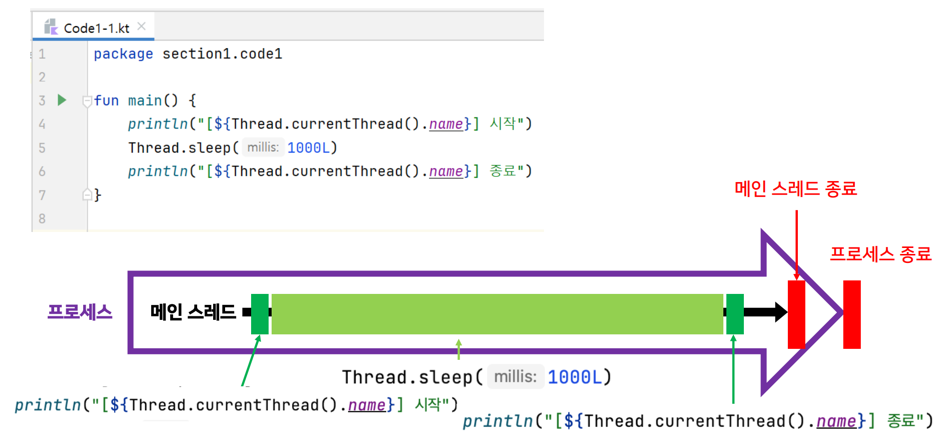

### 멀티 스레드 프로그래밍
- 여러 개의 스레드를 사용해 작업을 처리하는 프로그래밍 기법

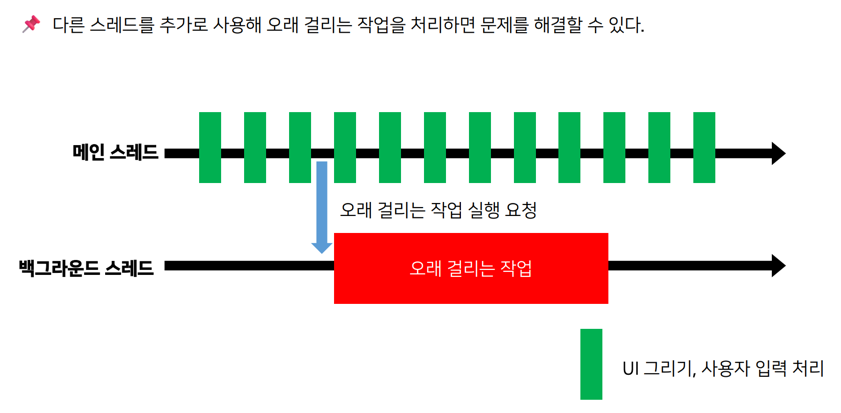
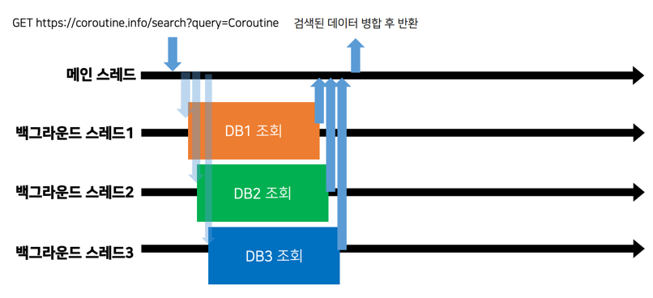

### 스레드, 스레드 풀을 사용한 멀티 스레드 프로그래밍
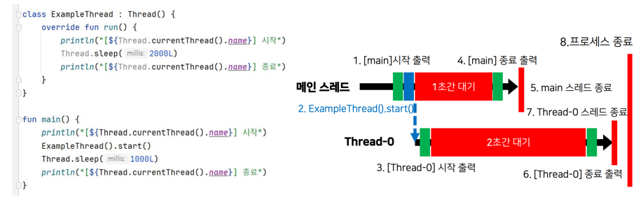

- Thread 멀티 스레드 프로그래밍의 한계?
  - 스레드는 비싼 자원이라 재사용이 어려운 것은 치명적이다.
  - 개발자가 스레드 생성과 관리에 대한 책임을 가진다 -> 개발자의 실수/오류, 스레드 생성과 관리를 직접 하는것은 어렵다.
- 위 문제를 해결하기 위해... 스레드를 간편하게 재사용할 수 있어야 하고, 스레드 관리 책임을 시스템에 넘긴다 -> `Executor`

#### Executor 
- (ExecutorService) 스레드의 집합인 스레드풀을 미리 생성해놓고, 작업을 요청 받으면 쉬고 있는 스레드에 작업을 분배할 수 있는 시스템

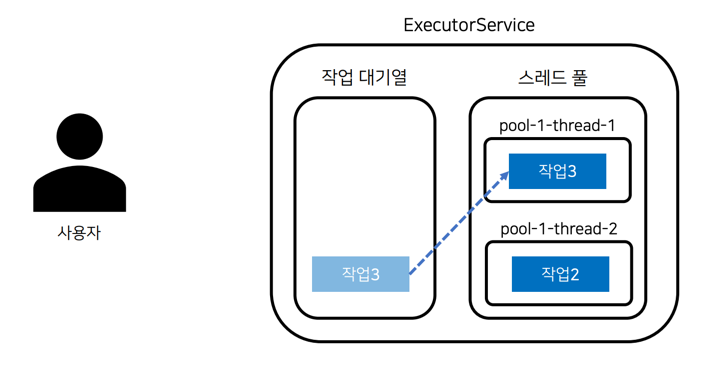

[Code1-2](src/main/kotlin/section2/Code1-2.kt)
- 개발자는 더이상 스레드를 직접 관리하지 않는다.
- 스레드의 재사용을 손쉽게 가능하도록 만들었다.
- `Executors.newFixedThreadPool(2)`

#### Executor 한계?
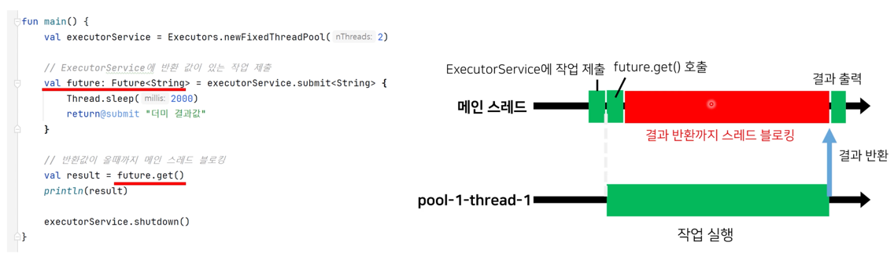
- 스레드 블로킹이 일어난다. (스레드가 사용될 수 없는 상태?)
- 위 문제를 해결하기 위해 Java 1.8 에서 `CompletableFuture` 도입
  - `CompletableFuture`: 콜백 방식을 통해 결과값을 처리하여 스레드 블로킹 방지
  - 하지만 여전히 콜백 지옥, 예외 처리 어려움 등의 문제가 존재한다.
- 여전히 작업이 스레드를 기반으로 동작한다는 한계를 가짐

### 스레드 기반 작업의 한계와 코루틴의 등장
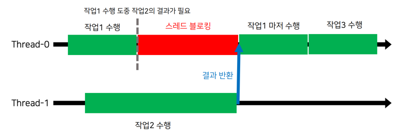
- 스레드 기반 작업들은 작업의 전환이 어렵고, 전환에 드는 비용이 비싸다.
- 실제 애플리케이션 작업은 복잡성으로 인해 스레드 블로킹이 필연적으로 발생한다.

#### 코루틴을 사용한 스레드 블로킹 문제 해결
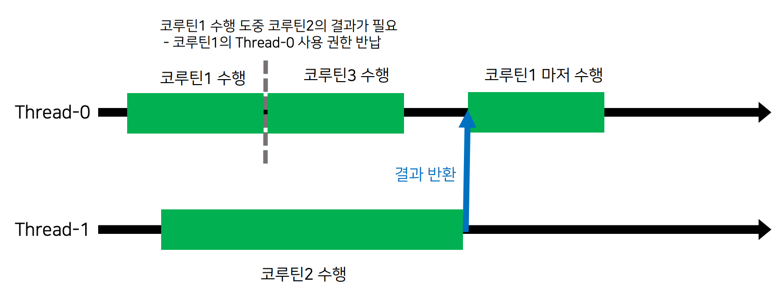
- 코루틴은 스레드의 사용 권한을 양보할 수 있다.
- 즉, 스레드에 붙였다 뗐다 할 수 있는 작업 단위
- 코루틴은 경량 스레드 라고 불린다.
- 이런 특징으로 인해 코루틴을 사용하면 입출력, I/O 작업 시 필요한 리소스가 줄어들게 된다.

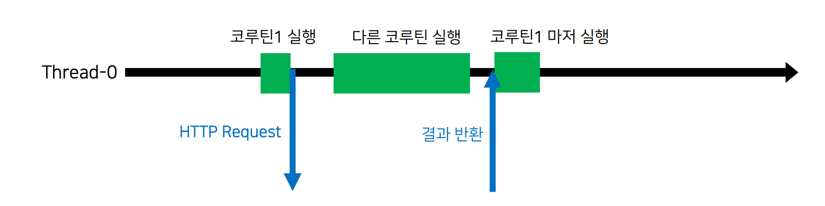
- IO 작업 (DB 입출력, 네트워크)

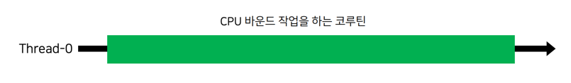
- CPU Bound (이미지, 동영상, 대용량 데이터 반환 등) 작업은 성능 차이가 크게 없다. -> 스레드 작업이 계속 필요하기 때문

<br>

## Hello Coroutines
### 코루틴 실행
- `runBlocking` 함수는 이 함수를 호출한 스레드를 사용해 실행되는 코루틴
- `runBlocking` 코루틴이 종료될 때 스레드 점유가 해제된다.
  - `runBlocking` = Run(실행) + Blocking(차단)

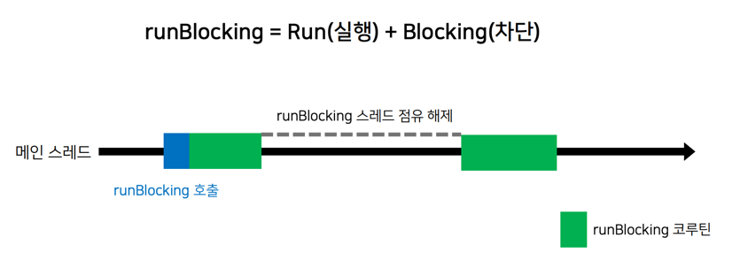
- 코루틴을 처음 만들 때 runBlocking 함수를 사용하고, 추가로 생성할 때는 launch 함수를 사용한다.

### 코루틴 디버깅 (콘솔, 브레이크 포인트)
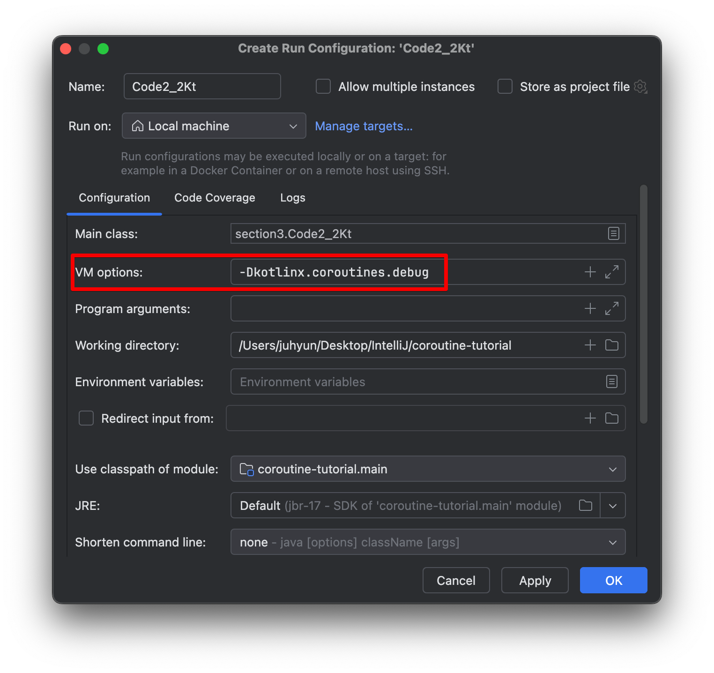
- JVM Options 설정

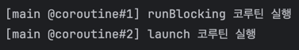


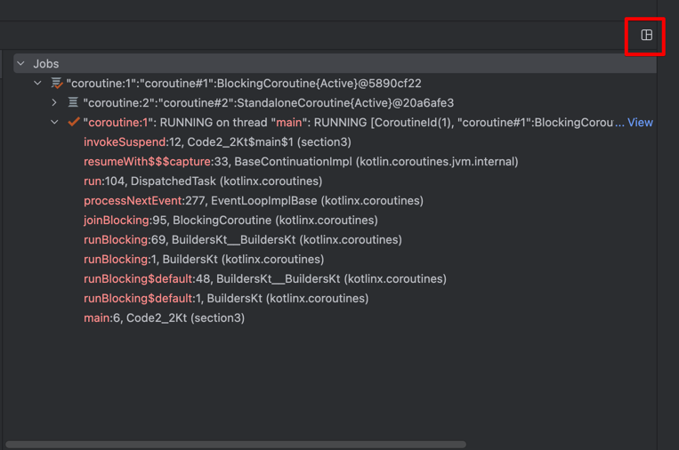
- Layout > Coroutines 추가

<br>

## CoroutineDispatcher
- Coroutine(코루틴) + Dispatcher(보내는 주체) -> 코루틴을 스레드로 보내는 실행시키는 객체

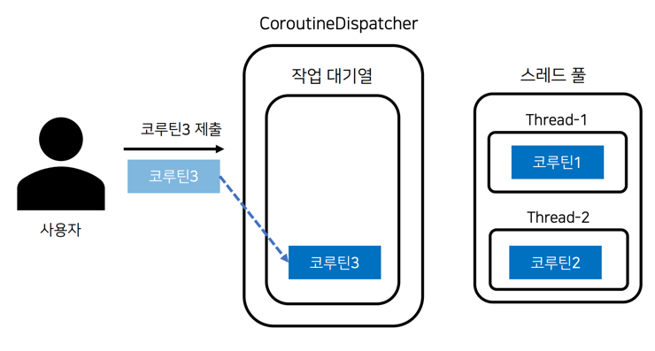
- 사용할 수 있는 스레드가 있다면, CoroutineDispatcher는 비어있는 스레드로 코루틴을 보내 실행시키는 주체

### 단일 스레드 디스패처
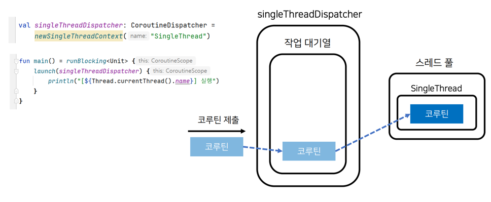

### 멀티 스레드 디스패처
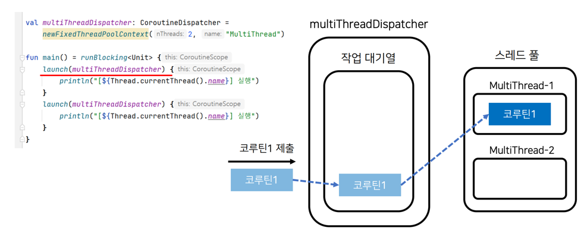

```
[MultiThread-2] Start
[MultiThread-1] Start
```

### 미리 정의된 CoroutineDispatcher

#### Dispatcher.IO
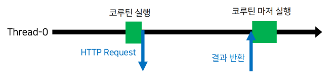
- 네트워크 요청이나 DB 읽기 쓰기 같은 입출력(I/O) 작업을 실행하는 디스패처
- 사용할 수 있는 스레드의 수: 64와 JVM에서 사용할 수 있는 프로세서의 수 중 큰 값

```kotlin
launch(multiThreadDispatcher) {
    println("[${Thread.currentThread().name}] Start")
}


// 부모 코루틴
launch(Dispatchers.IO) {

    // 자식 코루틴 -> 부모 코루틴에 설정된 CoroutineDispatcher 을 사용
    launch {
        println("[${Thread.currentThread().name}] Start1")
    }

    launch {
        println("[${Thread.currentThread().name}] Start2")
    }
}
```


#### Dispatchers.Default
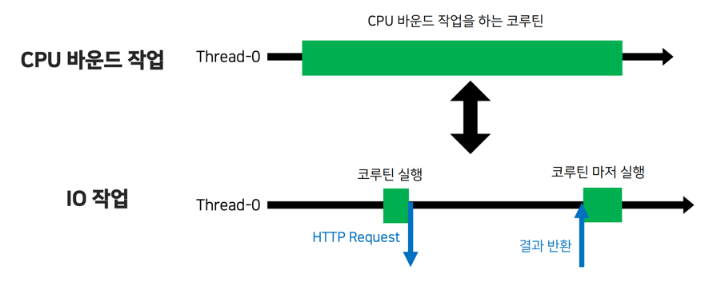
- Default -> CPU 바운드 작업을 위한 디스패처
- CPU 바운드 작업을 위해 IO 작업과 동일한 쓰레드 풀을 사용하면 CPU 바운드 작업이 모든 쓰레드를 사용할 경우, IO 작업이 제대로 실행되지 않을 수 있음

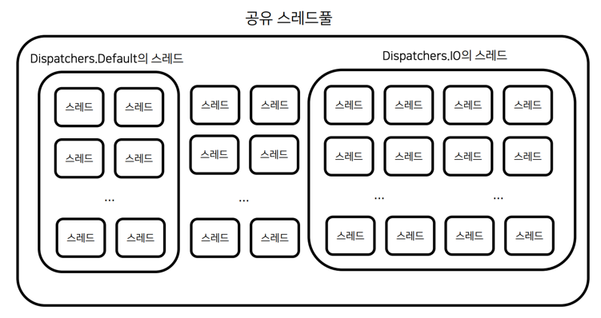
- 애플리케이션 레벨에서의 공유 스레드풀을 사용하기에 IO, Default의 스레드 명은 동일

#### Dispatchers.Default 의 limitedParallelism
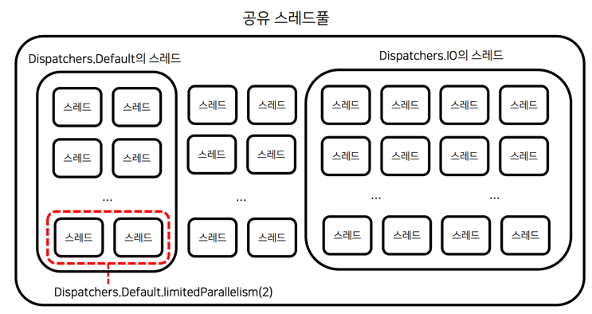
- 특정 작업 위에 사용할 수 있는 스레드 갯수를 제한할 수 있음
```
val imageProcessingDispatcher = Dispatchers.Default.limitedParallelism(2)
```

#### Dispatchers.IO 의 limitedParallelism
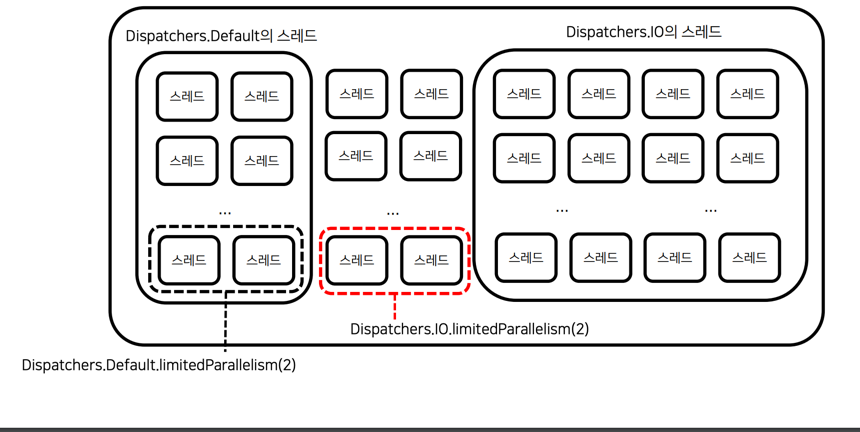
- Default의 limitedParallelism 와는 다르게, 별도의 공간에 스레드를 생성 (전용 스레드 풀)
- 다른 작업에 방해 받지 않아야 하는 중요한 작업에 사용할 수 있음

#### Dispatchers.Main
- 메인 스레드에서의 작업을 위한 디스패처

### Dispatcher 요약
1. Dispatchers.IO는 입출력 작업을 위한 CoroutineDispatcher
2. Dispatchers.Default는 CPU 바운드 작업을 위한 CoroutineDispatcher
3. Dispatchers.IO와 Dispatchers.Default는 코루틴 라이브러리의 공유 스레드풀을 사용
4. Dispatchers.Default의 limitedParallelism 함수를 사용하면, Dispatchers.Default의 스레드 중
   일부만을 사용하는 CoroutineDispatcher을 만들 수 있다.
5. Dispatchers.IO의 limitedParallelism 함수를 사용하면 공유 스레드풀의 별도 스레드를 사용하는
   CoroutineDispatcher를 만들 수 있다.
6. Dispatchers.Main은 메인 스레드를 사용하기 위한 디스패처이다.
7. Dispatchers.Main.immediate는 코루틴을 요청하는 스레드가 메인 스레드일 경우 작업 대기열에 적재되지 않고 곧바로 메인 스레드에서 실행된다.

<br>

## Job 객체를 활용한 코루틴 제어


## 코루틴으로부터 결과 수신 받기


## CoroutineContext


## 구조화된 동시성


## 예외 처리


## 일시 중단 함수


## 코루틴의 이해


## 코루틴 심화


## 코루틴 테스트
