## 코틀린 코루틴 완전 정복
- https://www.inflearn.com/course/코틀린-코루틴-완전-정복/dashboard
- https://github.com/seyoungcho2/coroutinelecture


## 스레드 기반 작업의 한계와 코루틴의 등장
### 단일 스레드 애플리케이션의 한계
- 한 번에 하나의 작업밖에 수행하지 못한다.

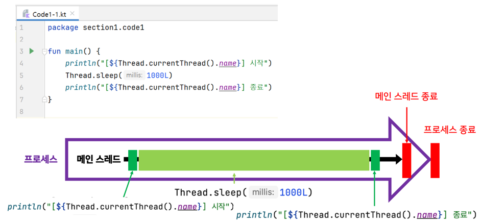

### 멀티 스레드 프로그래밍
- 여러 개의 스레드를 사용해 작업을 처리하는 프로그래밍 기법

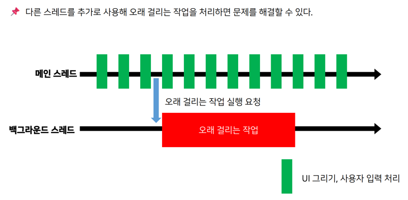


### 스레드, 스레드 풀을 사용한 멀티 스레드 프로그래밍
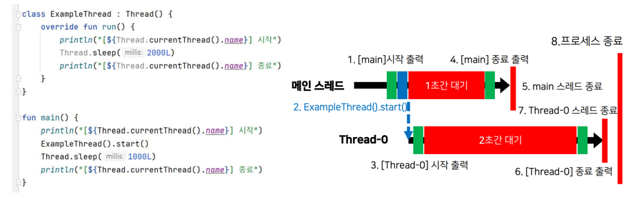

- Thread 멀티 스레드 프로그래밍의 한계?
  - 스레드는 비싼 자원이라 재사용이 어려운 것은 치명적이다.
  - 개발자가 스레드 생성과 관리에 대한 책임을 가진다 -> 개발자의 실수/오류, 스레드 생성과 관리를 직접 하는것은 어렵다.
- 위 문제를 해결하기 위해... 스레드를 간편하게 재사용할 수 있어야 하고, 스레드 관리 책임을 시스템에 넘긴다 -> `Executor`

#### Executor 
- (ExecutorService) 스레드의 집합인 스레드풀을 미리 생성해놓고, 작업을 요청 받으면 쉬고 있는 스레드에 작업을 분배할 수 있는 시스템

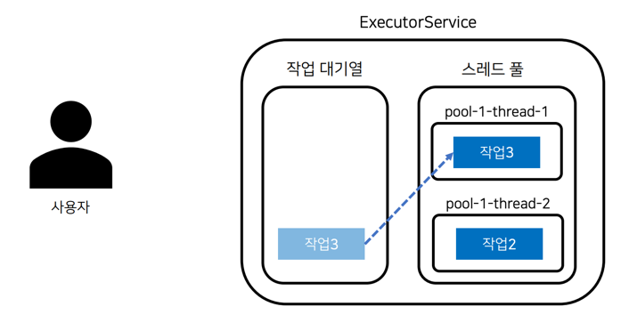

[Code1-2](src/main/kotlin/section2/Code1-2.kt)
- 개발자는 더이상 스레드를 직접 관리하지 않는다.
- 스레드의 재사용을 손쉽게 가능하도록 만들었다.
- `Executors.newFixedThreadPool(2)`

#### Executor 한계?
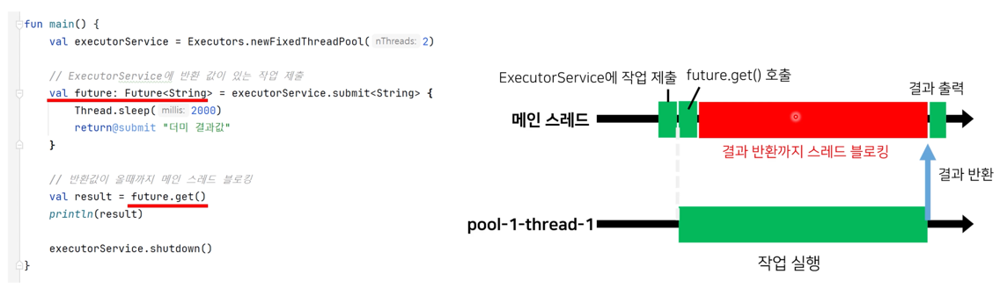
- 스레드 블로킹이 일어난다. (스레드가 사용될 수 없는 상태?)
- 위 문제를 해결하기 위해 Java 1.8 에서 `CompletableFuture` 도입
  - `CompletableFuture`: 콜백 방식을 통해 결과값을 처리하여 스레드 블로킹 방지
  - 하지만 여전히 콜백 지옥, 예외 처리 어려움 등의 문제가 존재한다.
- 여전히 작업이 스레드를 기반으로 동작한다는 한계를 가짐

### 스레드 기반 작업의 한계와 코루틴의 등장
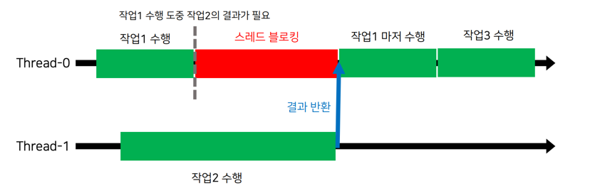
- 스레드 기반 작업들은 작업의 전환이 어렵고, 전환에 드는 비용이 비싸다.
- 실제 애플리케이션 작업은 복잡성으로 인해 스레드 블로킹이 필연적으로 발생한다.

#### 코루틴을 사용한 스레드 블로킹 문제 해결
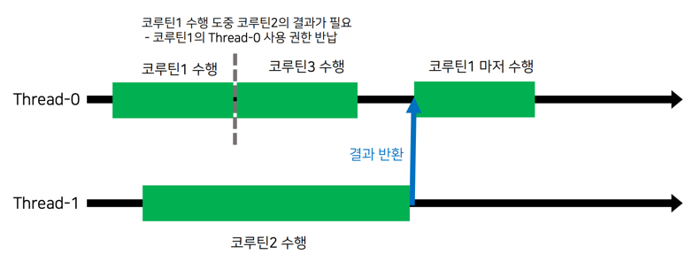
- 코루틴은 스레드의 사용 권한을 양보할 수 있다.
- 즉, 스레드에 붙였다 뗐다 할 수 있는 작업 단위
- 코루틴은 경량 스레드 라고 불린다.
- 이런 특징으로 인해 코루틴을 사용하면 입출력, I/O 작업 시 필요한 리소스가 줄어들게 된다.

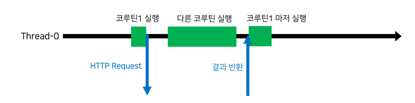
- IO 작업 (DB 입출력, 네트워크)

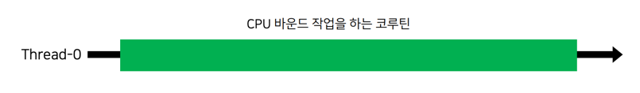
- CPU Bound (이미지, 동영상, 대용량 데이터 반환 등) 작업은 성능 차이가 크게 없다. -> 스레드 작업이 계속 필요하기 때문

<br>

## Hello Coroutines
### 코루틴 실행
- `runBlocking` 함수는 이 함수를 호출한 스레드를 사용해 실행되는 코루틴
- `runBlocking` 코루틴이 종료될 때 스레드 점유가 해제된다.
  - `runBlocking` = Run(실행) + Blocking(차단)

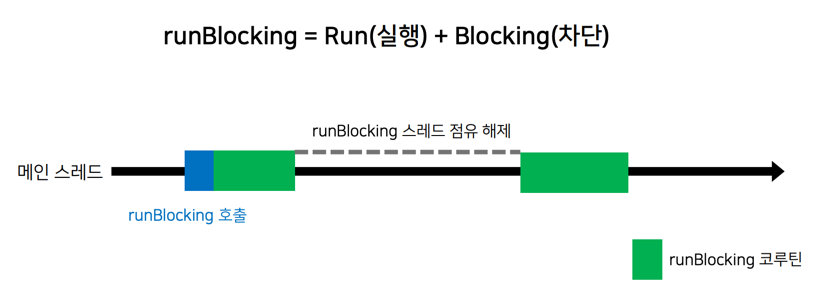
- 코루틴을 처음 만들 때 runBlocking 함수를 사용하고, 추가로 생성할 때는 launch 함수를 사용한다.

### 코루틴 디버깅 (콘솔, 브레이크 포인트)
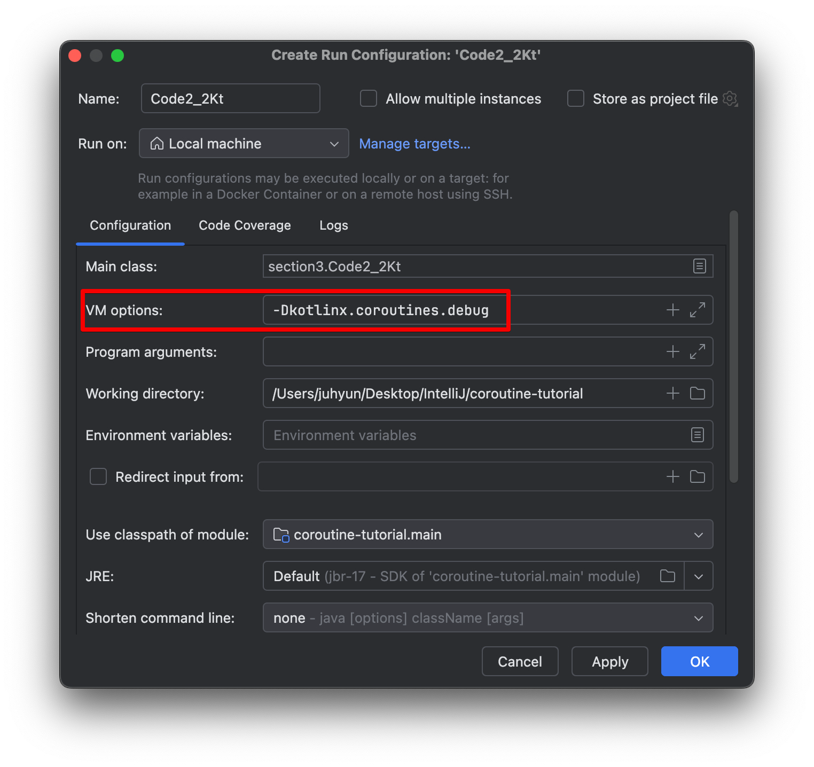
- JVM Options 설정

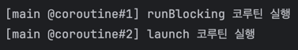


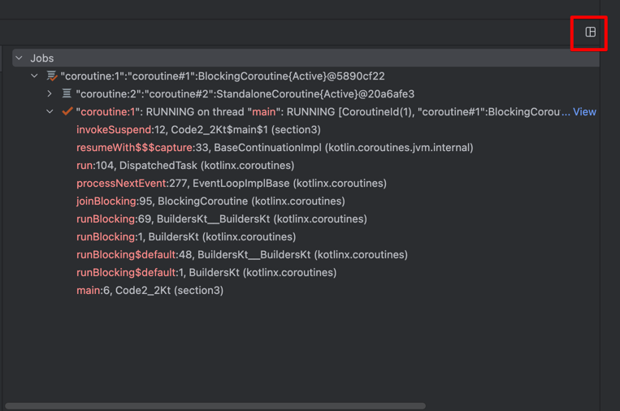
- Layout > Coroutines 추가

<br>

## CoroutineDispatcher
- Coroutine(코루틴) + Dispatcher(보내는 주체) -> 코루틴을 스레드로 보내는 실행시키는 객체

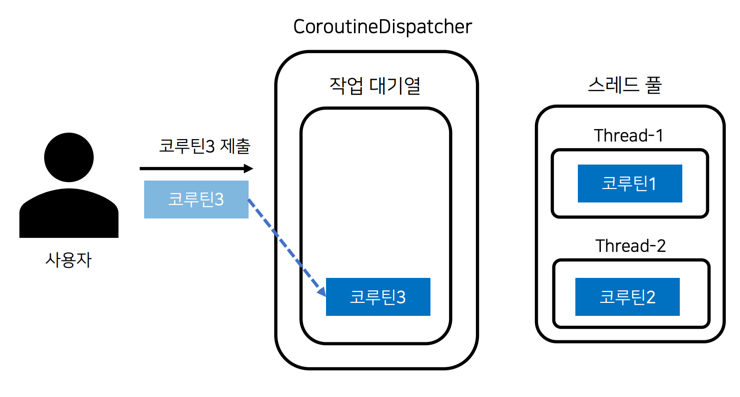
- 사용할 수 있는 스레드가 있다면, CoroutineDispatcher는 비어있는 스레드로 코루틴을 보내 실행시키는 주체

### 단일 스레드 디스패처
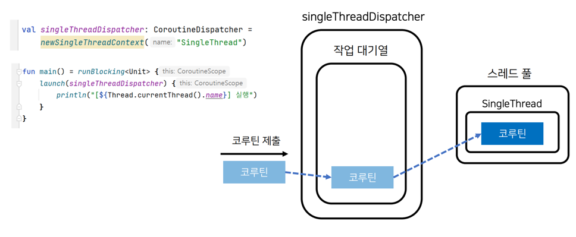

### 멀티 스레드 디스패처
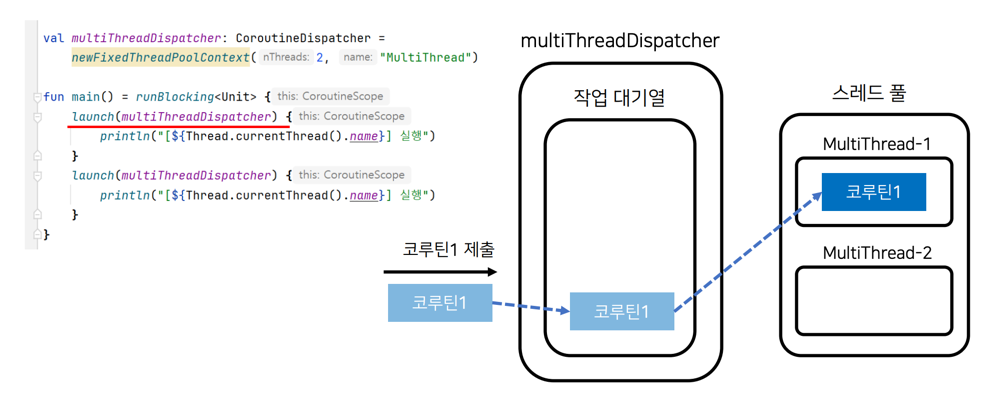

```
[MultiThread-2] Start
[MultiThread-1] Start
```

### 미리 정의된 CoroutineDispatcher

#### Dispatcher.IO
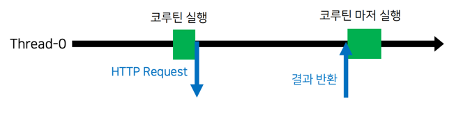
- 네트워크 요청이나 DB 읽기 쓰기 같은 입출력(I/O) 작업을 실행하는 디스패처
- 사용할 수 있는 스레드의 수: 64와 JVM에서 사용할 수 있는 프로세서의 수 중 큰 값

```kotlin
launch(multiThreadDispatcher) {
    println("[${Thread.currentThread().name}] Start")
}


// 부모 코루틴
launch(Dispatchers.IO) {

    // 자식 코루틴 -> 부모 코루틴에 설정된 CoroutineDispatcher 을 사용
    launch {
        println("[${Thread.currentThread().name}] Start1")
    }

    launch {
        println("[${Thread.currentThread().name}] Start2")
    }
}
```


#### Dispatchers.Default
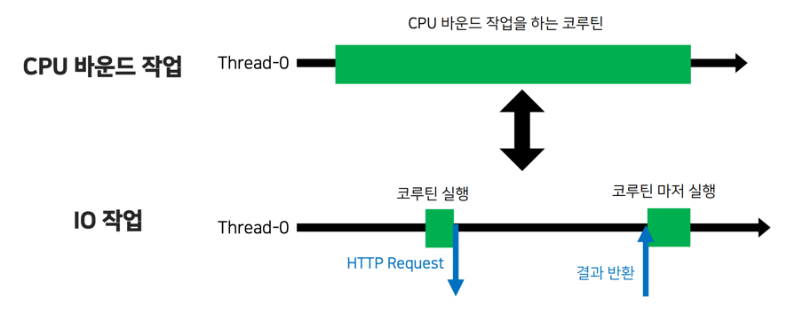
- Default -> CPU 바운드 작업을 위한 디스패처
- CPU 바운드 작업을 위해 IO 작업과 동일한 쓰레드 풀을 사용하면 CPU 바운드 작업이 모든 쓰레드를 사용할 경우, IO 작업이 제대로 실행되지 않을 수 있음

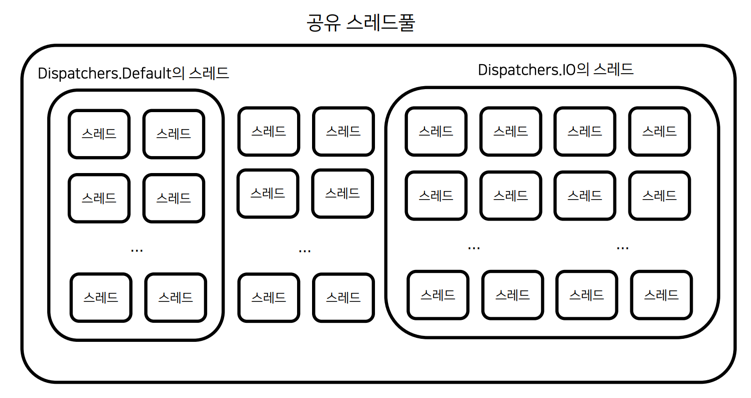
- 애플리케이션 레벨에서의 공유 스레드풀을 사용하기에 IO, Default의 스레드 명은 동일

#### Dispatchers.Default 의 limitedParallelism
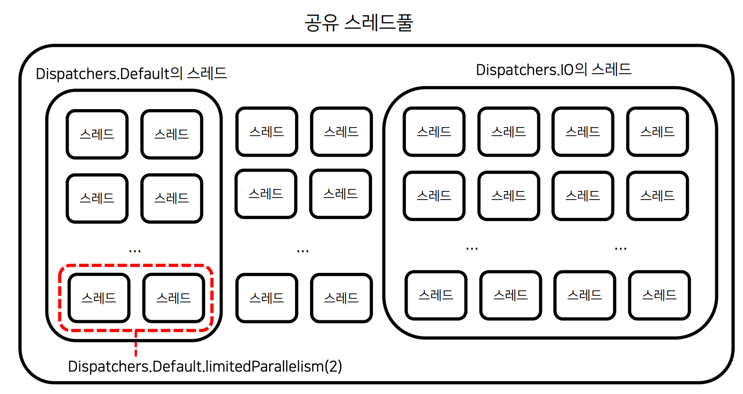
- 특정 작업 위에 사용할 수 있는 스레드 갯수를 제한할 수 있음
```
val imageProcessingDispatcher = Dispatchers.Default.limitedParallelism(2)
```

#### Dispatchers.IO 의 limitedParallelism
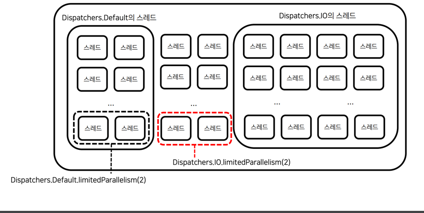
- Default의 limitedParallelism 와는 다르게, 별도의 공간에 스레드를 생성 (전용 스레드 풀)
- 다른 작업에 방해 받지 않아야 하는 중요한 작업에 사용할 수 있음

#### Dispatchers.Main
- 메인 스레드에서의 작업을 위한 디스패처

### Dispatcher 요약
1. Dispatchers.IO는 입출력 작업을 위한 CoroutineDispatcher
2. Dispatchers.Default는 CPU 바운드 작업을 위한 CoroutineDispatcher
3. Dispatchers.IO와 Dispatchers.Default는 코루틴 라이브러리의 공유 스레드풀을 사용
4. Dispatchers.Default의 limitedParallelism 함수를 사용하면, Dispatchers.Default의 스레드 중
   일부만을 사용하는 CoroutineDispatcher을 만들 수 있다.
5. Dispatchers.IO의 limitedParallelism 함수를 사용하면 공유 스레드풀의 별도 스레드를 사용하는
   CoroutineDispatcher를 만들 수 있다.
6. Dispatchers.Main은 메인 스레드를 사용하기 위한 디스패처이다.
7. Dispatchers.Main.immediate는 코루틴을 요청하는 스레드가 메인 스레드일 경우 작업 대기열에 적재되지 않고 곧바로 메인 스레드에서 실행된다.

<br>

## Job 객체를 활용한 코루틴 제어
### 코루틴 순차 처리

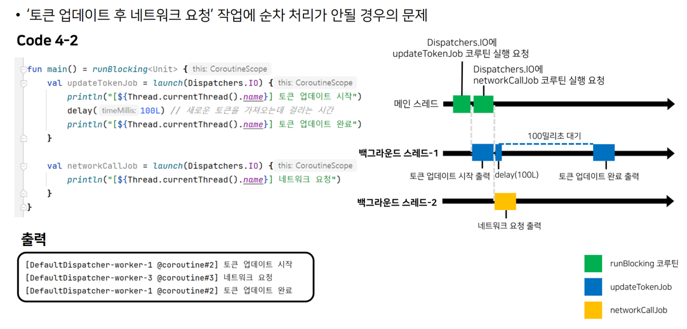
- '토큰 업데이트 후 네트워크 요청', '이미지 변환 후 업로드 요청' 같이 작업 간 선후 관계(종속성) 있는 작업들이 있다.
- 이런 작업들이 순차 처리가 안된다면, 문제가 발생한다.
    - 토큰 업데이특 되기 전 네트워크 요청이 온다면? 401에러 발생

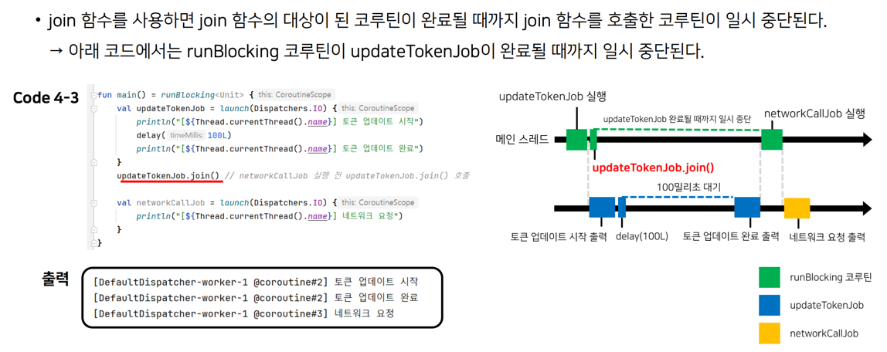
- Job 의 `join` 함수를 사용 -> join 함수 호출부의 코루틴을 join 함수의 대상이 되는 코루틴이 완료될때까지 일시중단
- joinAll -> 복수의 코루틴 순차 처리
```joinAll(Job1, Job2, ...)```

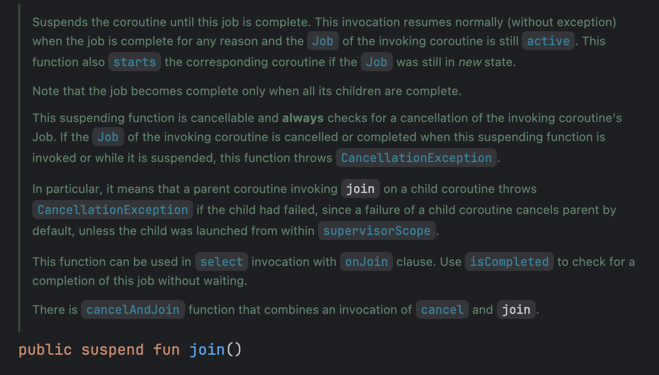

### CoroutineStart.LAZY
- 즉시 실행되지 않고 지연되는 코루틴  
  - ```val lazyJob: Job = launch(start = CoroutineStart.LAZY)```
- start(), join() 함수를 통해 실행 가능

### 코루틴 취소
- 코루틴 실행 도중, 더이상 코루틴을 실행할 필요가 없어지면 즉시 취소해야 한다.
  - 취소하지 않으면 코루틴이 스레드를 계속 사용하기 때문에 애플리케이션의 성능 저하로 이어지기 때문
  - ex) 사용자가 오래 걸리는 이미지 변환 작업을 요청한 후 취소한 경우
- `cancel()` 코루틴 취소
  - 코루틴을 곧바로 취소하지 않고, 취소 확인용 플래그를 '취소 요청됨'으로 바꾸는 역할만 한다.
  - 이후 미래에 취소 확인용 플래그가 확인되는 시점에 코루틴이 취소된다.
  - -> cancel 함수를 사용하는 것은 순차성 관점에서 중요한 문제
- 따라서, `cancelAndJoin()` 함수를 사용
  - 취소 요청한 후 취소가 완료될 때까지 호출 코루틴 일시 중단
- `코루틴의 취소가 직관적이지 않은 문제는 실무에서 매우 치명적인 문제를 일으키는 경우가 많기에 매우 중요하다.`

### 코루틴 취소 확인 시점
- 코루틴이 취소를 확인하는 시점은 다음 두가지
  - 일시 중단 시점 
  - 코루틴이 실행을 대기하는 시점

```kotlin
fun main() = runBlocking<Unit> {
    var count = 0
    val whileJob: Job = launch(Dispatchers.Default) {
        while(this.isActive) { // Coroutine.isActive -> count: 85000
//        while(true) {
            count++
            println(count)
            // delay(1L) count: 80
            // yield() count: 48900
        }
    }
    delay(100L) // 100밀리초 대기
    whileJob.cancel() // 코루틴 취소
}
```

- delay 함수를 사용하면 일시 중단 시점을 만들 수 있지만, 일정 시간 동안 스레드를 양보하기 때문에 비효율적 (count: 80)
- yield 함수를 사용하면 일시 중단 시점을 만든 후 곧바로 재개 요청되기 때문에 delay 함수보다는 효율적 (count: 48900)
- 하지만, 위 두 함수 모두 일시 중단 시점을 만들어 재개 되는 과정을 거치기 때문에 비효율적
- CoroutineScope 의 isActive 확장 프로퍼티를 사용하면 코루틴을 일시 중단 시키지 않고 취소를 확인할 수 있다. (count: 85000)

### 코루틴의 상태와 Job 객체의 상태 변수
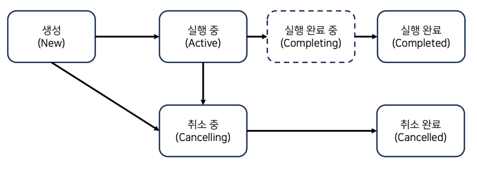
- 지연 코루틴(CoroutineStart.LAZY) -> 생성(New)
- 코루틴 생성 후 출력 -> 실행 중(Active)
- join() -> 실행 완료(Completed)
- cancel() -> 취소 중(Cancelling)
- cancelAndJoin() -> 취소 완료(Cancelled)

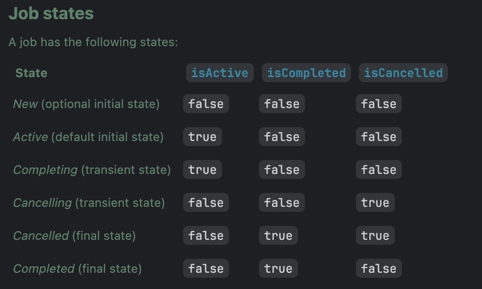

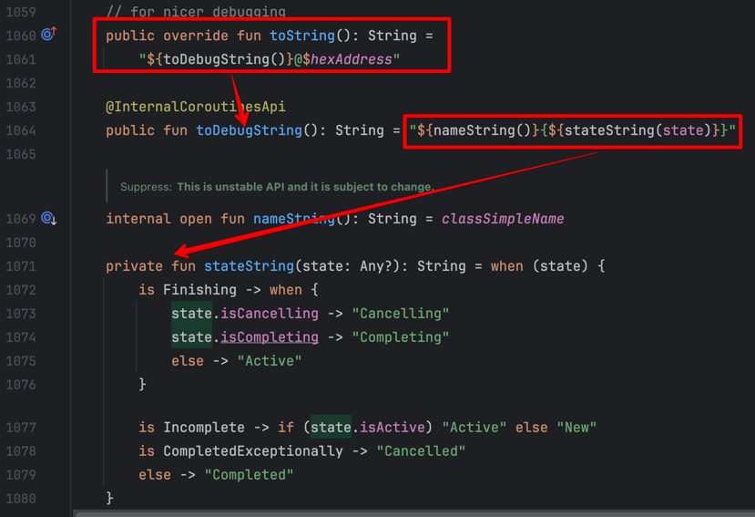


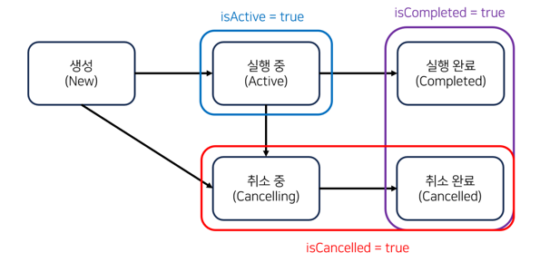  
Job 객체는 코루틴을 추상화한 객체로 코루틴의 상태를 간접적으로 나타내는 세가지 상태 변수를 외부로 공개한다
1. `isActive`: 코루틴이 활성화 되어 있는지 여부. 코루틴이 '실행 중' 상태일 때 true
2. `isCancelled`: 코루틴에 취소가 요청됐는지 여부. (cancel) 취소 중인 상태도 포함
3. `isCompleted`: 코루틴이 완료 되었는지 여부. 코루틴이 실행 완료 되거나 취소 완료되면 true

### 요약
#### 코루틴 순차 처리
- Job 객체의 join 함수를 사용해 코루틴 순차 처리를 할 수 있다.
- join 함수를 호출한 코루틴을 join의 대상이 된 코루틴이 완료될 때까지 일시 중단시킨다.
- joinAll 함수를 사용해 복수의 코루틴에 대해 순차 처리가 가능하다.

#### CoroutineStart.LAZY 지연 코루틴
- launch(start = CoroutineStart.LAZY)
- start, join 함수가 호출될 때까지 실행 요청되지 않는다.

#### 코루틴 취소
- cancel 함수 -> 취소 확인용 플래그 변경
- cancelAndJoin 함수 -> 함수를 호출한 코루틴을 취소가 완료될 때까지 일시 중단할 수 있다.

#### 코루틴 취소 확인
- delay(), yield(), CoroutineScope.isActive

#### 코루틴 상태와 상태 변수
- 생성(New), 실행 중(Active), 실행 완료 중 (Completing), 실행 완료(Completed), 취소 중(Cancelling), 취소 완료(Cancelled)
- isActive, isCancelled, isCompleted

<br>

## 코루틴으로부터 결과 수신 받기
### async-await, Deferred
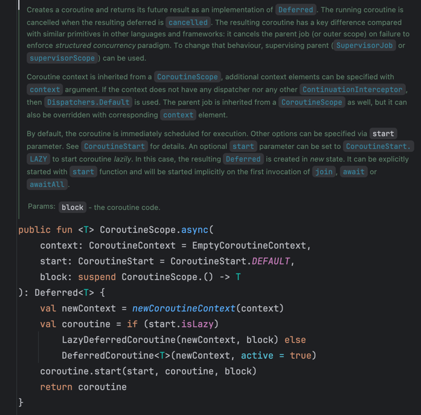
- async 코루틴 빌더는 Deferred<T> 객체를 반환하고 결과값이 이 객체에 포함된다.
- async 함수도 launch 함수와 대부분 비슷하나, 반환 타입의 차이점이 존재한다.
- Deferred 객체는 미래의 어느 시점에 결과값이 반환될 수 있음을 표현하는 코루틴 객체
  - 따라서 결과값이 필요하다면 결과값이 수신될 때까지 대기해야 한다. (await 함수)

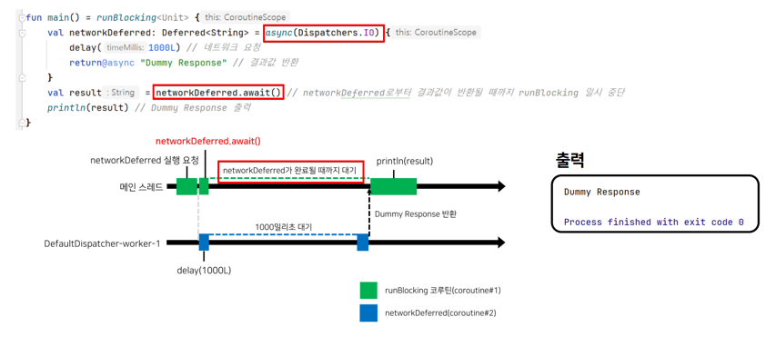


### 복수의 코루틴으로부터 결과값 수신하기
예) 콘서트를 주최하고 2개의 플랫폼에서 관람객 모집 후 모집된 관람객을 병합해 출력하기

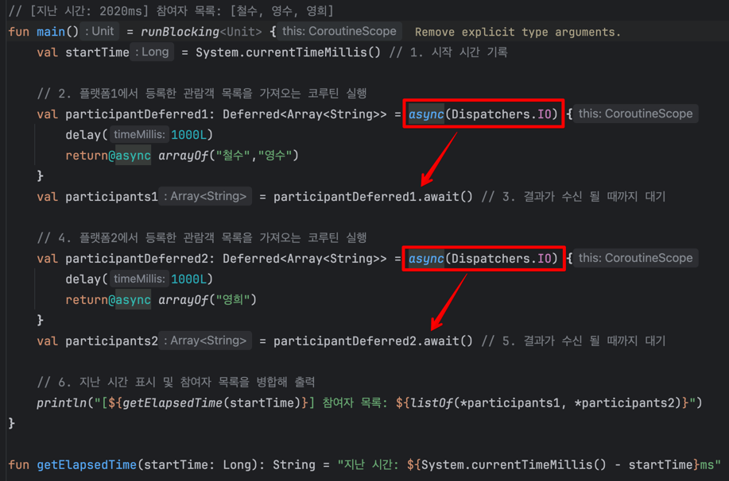
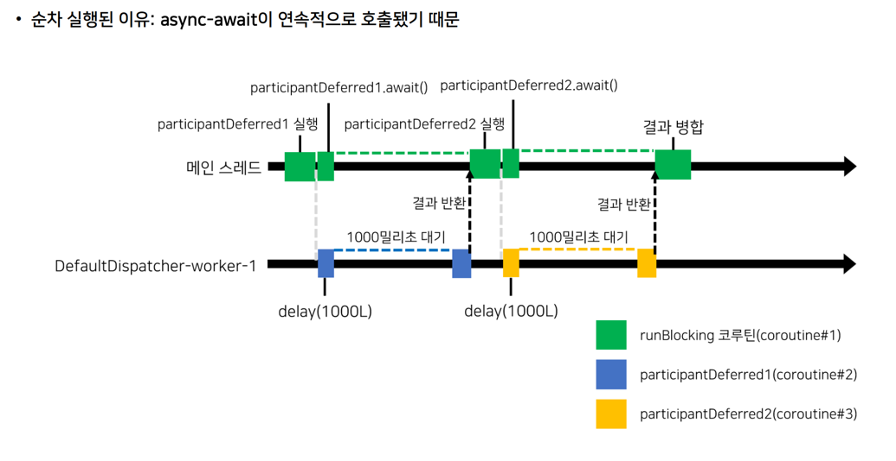
- async-await 이 연속적으로 호출되면, 코루틴이 실행 완료되고 나서 다음 코드가 실행된다. -> Blocking

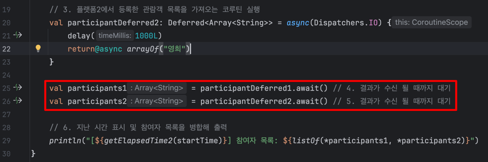
- 따라서, 코루틴을 모두 실행한 후 await() 을 호출해야 한다.
- 혹은, awaitAll() 사용 가능
  - ```val results = awaitAll(participantDeferred1, participantDeferred2)```

### withContext 함수를 사용한 결과 수신
- 인자로 받은 CoroutineDispatcher를 사용해 코루틴의 실행 스레드를 전환하고, 람다식의 코드를 실행한 후 결과값을 반환하는 함수
  - 람다식 실행 후 스레드는 다시 이전의 Dispatcher를 사용하도록 전환된다.
  - ```val result: String = withContext(Dispatchers.IO) { ...```

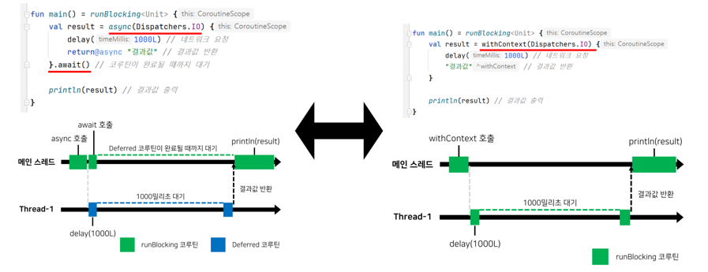
- async-await와 달리 withContext는 코루틴의 실행 스레드를 전환한다. -> 하나의 코루틴이 순차처리됨

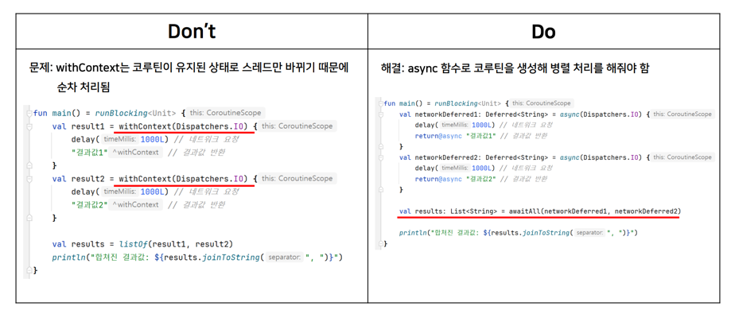
- withContext -> 코루틴이 유지된 채 스레드만 바뀌기 때문에 이전 작업이 완료할 때까지 다음 작업이 진행되지 못하고 순차 처리가 된다.
- `withContext` 는 간결하게 사용할 수 있지만, 잘못 사용할 경우 성능 문제를 일으킬 수 있기 때문에 잘 이해하고 사용해야 한다.

### 섹션 요약
#### async-await 을 통해 코루틴으로부터 결과 수신받기 
- async 코루틴 빌더를 호출하면 코루틴이 생성되고, Deferred<T> 타입의 객체가 반환된다. 
- Deferred 객체는 미래의 어느 시점에 결과값이 반환될 수 있음을 표현하는 코루틴 객체이다. 
- Deferred 객체로부터 결과값을 수신하기 위해서는 await 함수를 호출하면 된다.
#### Deferred
- Deferred는 Job의 서브타입으로, 코루틴으로부터의 결과값 수신을 위해 몇가지 함수만 추가된 인터페이스이다. (await)
- 따라서 Job의 모든 함수(join, cancel 등)와 프로퍼티(isActive, isCancelled 등)을 사용할 수 있다
#### 복수의 코루틴으로부터 결과값 수신하기
- 모든 코루틴을 실행한 후 await 함수를 호출해야 병렬 처리할 수 있다.
- awaitAll 함수를 사용해 복수의 코루틴으로부터 결과값을 수신할 수 있다.
#### withContext 함수를 사용한 결과 수신
- withContext 함수는 인자로 받은 CoroutineDispatcher를 사용해 코루틴의 실행 스레드를 전환하고, 코드를 실행한 후
결과값을 반환하는 함수이다. 
- withContext를 사용하면 코루틴이 생성되지 않는다. 
- 코루틴들이 병렬로 실행돼야 할 때는 withContext 함수를 사용하면 안된다. async를 사용해야 한다

| 위 내용들은 실무에 정말 많이 사용되기 때문에 async vs withContext 동작원리를 꼭 기억하자!

<br>

## CoroutineContext
### CoroutineContext 구성요소
- CoroutineName: 코루틴 이름 설정에 사용되는 객체
- CoroutineDispatcher: 코루틴을 스레드에 보내서 실행하는 객체
- Job: 코루틴의 추상체로 코루틴을 조작하는데 사용되는 객체
- CoroutineExceptionHandler: 코루틴에서 발생된 예외를 처리

### CoroutineContext 구성하기
- CoroutineContext 객체는 구성요소에 대해 key-value 쌍으로 요소를 관리한다.
- 구성 요소를 추가하기 위해서는 더하기 연산자를 사용하면 되는데, 키에 값을 직접 대입하는 방법을 사용하지 않기 때문
  - ```val coroutineContext = newSingleThreadContext("MyThread") + CoroutineName("MyCoroutine")```
- 같은 구성 요소가 둘 이상 더해지면, 나중에 추가된 구성요소가 이전 값을 덮어씌운다.

### CoroutineContext 구성요소에 접근하기
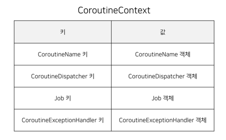
- CoroutineContext 구성요소의 키는 각각의 Key 인터페이스를 통해 실글톤 객체로 구현된다.
  - ```public companion object Key : CoroutineContext.Key<CoroutineName>```
  - ```public companion object Key : CoroutineContext.Key<Job>```
  - ...

### CoroutineContext 구성 요소 제거하기
- `minusKey()` 함수를 호출하고, 구성요소의 키를 전달

### 섹션 요약
#### CoroutineContext
- CoroutineName, CoroutineDispatcher, Job, CoroutineExceptionHandler
- CoroutineContext 객체는 구성 요소에 대해 Key-Value 쌍으로 관리
- CoroutineContext 객체에 구성 요소를 추가하기 위해서는 더하기 연산자(+)를 사용
- CoroutineContext 동일 요소가 추가되면, 이전 요소는 덮어씌워진다.
- CoroutineContext 구성 요소에 접근하기 위해서 get 함수의 Key를 넘긴다. (생략 가능)
- CoroutineContext 의 minusKey 함수를 통해 특정 구성 요소를 제거할 수 있다. 
  - 기존 객체는 그대로 유지, 구성 요소가 제거된 새로운 CoroutineContext 객체가 반환

<br>

## 구조화된 동시성
- 비동기 작업을 구조화해 비동기 프로그래밍을 보다 안정적이고, 예측 가능하게 만드는 원칙
- 코루틴은 구조화된 동시성의 원칙을 사용해 비동기 작업인 코루틴을 부모-자식 관계로 구조화해 코루틴이 보다 안전하게 관리되고 제어될 수 있도록 한다.
- 부모-자식 관계로 구조화하기 위해서는 코루틴 빌더 함수의 람다식 안에 새로운 코루틴 빌더 함수를 호출하기만 하면 된다.

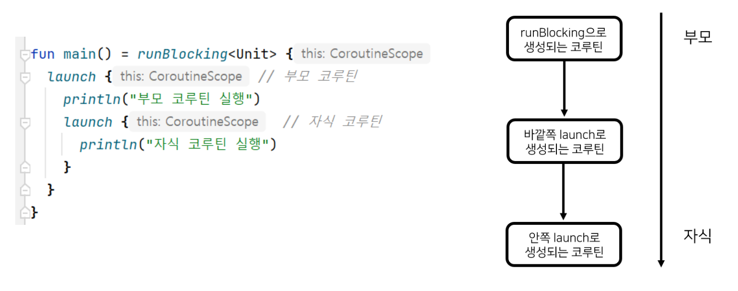

### 실행 환경 상속
- 부모 코루틴은 자식 코루틴에게 실행 환경을 상속한다.
- 부모 코루틴이 자식 코루틴을 생성하면 부모 코루틴의 CoroutineContext 가 자식 코루틴에게 전달된다.

#### 상속되지 않는 Job
- launch나 async를 포함한 모든 코루틴 빌더 함수는 호출 시마다 코루틴 추상체인 Job 객체를 새롭게 생성한다.
- 코루틴 제어에 Job 객체가 필요하기 때문에, Job 객체를 부모 코루틴으로부터 상속 받지 않는다.
- 즉, 코루틴 빌더를 통해 생성된 코루틴들은 서로 다른 Job을 가진다.
- Job 객체는 새로 생성되나 생성된 Job 객체는 내부에 정의된 parent 프로퍼티를 통해 부모 코루틴의 Job 객체에 대한 참조를 가진다.
- 부모 코루틴의 Job 객체는 children 프로퍼티를 통해 자식 코루틴들의 Job 객체에 대한 참조를 가진다.
  - parent -> Job? (부모 코루틴이 있을수도, 없을수도 있음)
  - children -> Sequence<Job> (하나의 코루틴이 복수의 자식 코루틴을 가질 수 있음)

### 코루틴의 구조화와 작업 제어
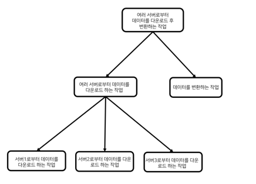
- 코루틴의 구조화는 하나의 큰 비동기 작업을 작은 비동기 작업으로 나눌 때 일어난다.
- 여러 서버로부터 데이터를 받고, 합쳐진 데이터를 변환하는 비동기 작업의 예시

#### 구조화된 코루틴의 특성 - 1. 취소의 전파
- 코루틴으로 취소가 요청되면 자식 코루틴에만 취소가 전파된다.
  - 자식 -> 부모 (X)
  - 부모 -> 다른 자식(X)  
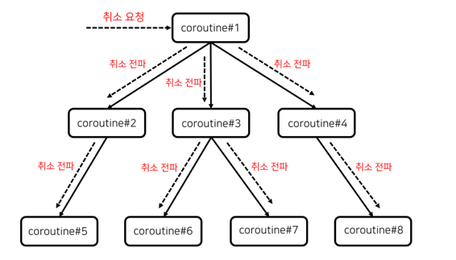

#### 구조화된 코루틴의 특성 - 2. 부모 코루틴의 자식 코루틴에 대한 완료 의존성
- 부모 코루틴은 모든 자식 코루틴이 실행 완료되어야 완료될 수 있다.
- 작은 작업(자식)이 완료돼야 큰 작업(부모)가 완료
```kotlin
    val startTime = System.currentTimeMillis()
    val parentJob = launch { // 부모 코루틴 실행
        launch { // 자식 코루틴 실행
            delay(1000L) // 1초간 대기
            println("[${getElapsedTime(startTime)}] 자식 코루틴 실행 완료")
        }
        println("[${getElapsedTime(startTime)}] 부모 코루틴이 실행하는 마지막 코드")
    }
    parentJob.invokeOnCompletion { // 부모 코루틴이 완료될 시 호출되는 콜백 등록
        println("[${getElapsedTime(startTime)}] 부모 코루틴 실행 완료")
    }
```
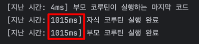

- '실행 완료 중(Completing)' 상태는 부모 코루틴의 모든 코드가 실행됐지만, 자식 코루틴이 실행중인 경우 부모 코루틴이 갖는 상태
- 즉, 자식 코루틴들이 모두 완료될 때까지 기다리는 상태
- 자식 코루틴이 모두 완료되면, '실행 완료(Completed)' 상태로 바뀐다.

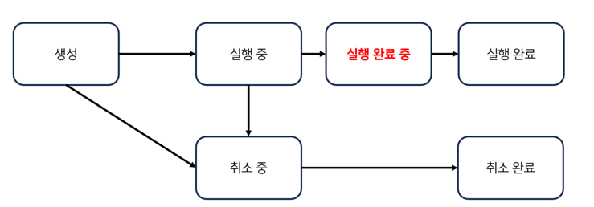

### CoroutineScope 사용해 코루틴 관리하기
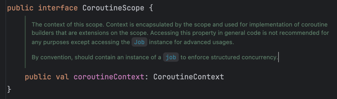

```kotlin
fun main() {
    val newScope = CoroutineScope(CoroutineName("MyCoroutine") + Dispatchers.IO)
    newScope.launch(context = CoroutineName("LaunchCoroutine")) {
        println("newScope의 coroutineContext: ${newScope.coroutineContext}")
        println("launch 코루틴의 coroutineContext: ${this.coroutineContext}")
        println("launch 코루틴의 parentJob: ${this.coroutineContext[Job]?.parent}")
    }
    Thread.sleep(1000L)
}

/*
newScope의 coroutineContext: [CoroutineName(MyCoroutine), JobImpl{Active}@1e904cc, Dispatchers.IO]
launch 코루틴의 coroutineContext: [CoroutineName(LaunchCoroutine), StandaloneCoroutine{Active}@5882160d, Dispatchers.IO]
launch 코루틴의 parentJob: JobImpl{Active}@1e904cc
 */
```
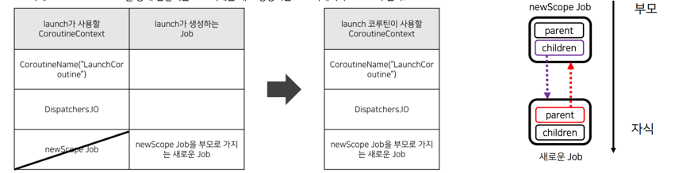

#### CoroutineScope에 속한 코루틴 범위
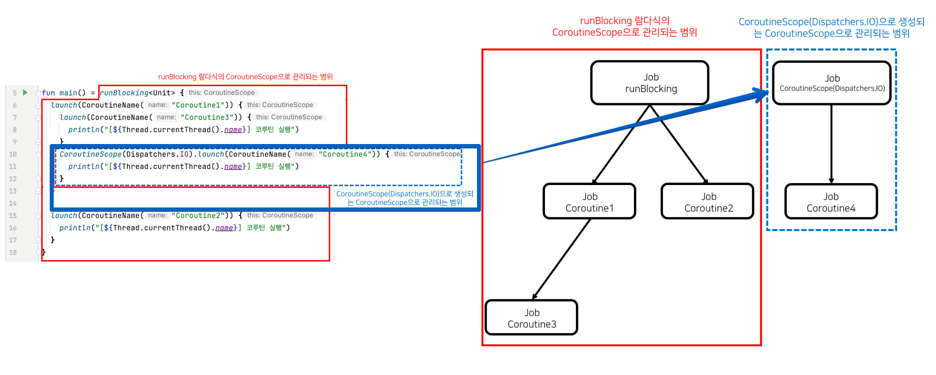
- CoroutineScope 객체는 특정 범위의 코루틴을 제어하는 역할을 한다. (Job 객체를 통해)

### 구조화와 Job
- runBlocking 함수를 호출하면 부모 Job이 없는 루트 Job 객체가 생성된다.
  - 루트 Job: 부모 Job 객체가 없는 구조화의 시작점 역할을 하는 Job 객체
  - 루트 코루틴: 이 Job 객체에 의해 제어되는 코루틴
```kotlin
fun main() = runBlocking<Unit> { // 루트 코루틴(루트 Job) 생성
    println("...")
}
```

#### Job 구조화 깨는 법 - CoroutineScope, Job 객체 생성
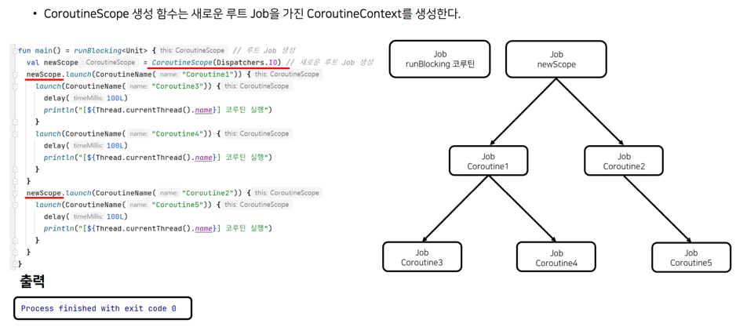
- runBlocking 코루틴이 종료되면 메인 스레드도 종료되어서, 구조화가 깨진 newScope 는 출력되지 않음

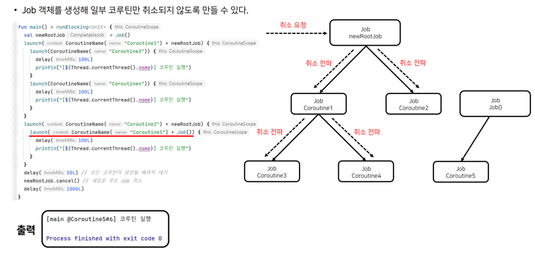
- Job 객체를 활용하여 구조화를 깰 수 있고, 일부 코루틴에 대한 제어가 가능함

### runBlocking 함수의 이해
- runBlocking 함수가 호출되면 호출부의 스레드를 차단하고 배타적으로 사용하는 코루틴이 만들어진다.
  - 호출부의 스레드를 사용할 수 있는 코루틴은 자신과 자식 코루틴들 뿐이다.
- 호출부의 스레드는 runBlocking 함수가 생성한 코루틴이 실행 완료될 때까지 다른 작업에 사용될 수 없다.

```kotlin
fun main() = runBlocking<Unit> {
    delay(5000L)
    println("[${Thread.currentThread().name}] 코루틴 종료")
}
```
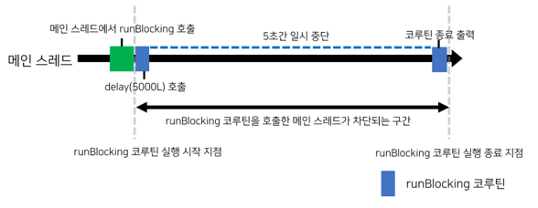

1. 메인스레드에서 runBlocking 함수가 호출되어 파란색 runBlocking 코루틴 생성
2. runBlocking 코루틴은 delay(5000L) 으로 인해 5초간 일시 중단
3. 이 사이(5초간) runBlocking이 실행되는 구간에서 메인 스레드는 다른 작업이 실행될 수 없도록 차단
   - 일반적인 스레드 차단은 스레드가 어떤 작업에도 사용될 수 없는 것을 뜻하는데,
   - 여기서의 차단은 runBlocking 코루틴과 자식 코루틴들을 제외한 다른 작업이 스레드를 사용할 수 없게 만드는 차단

```kotlin
fun main() = runBlocking<Unit> {
    val startTime = System.currentTimeMillis()

    launch {
        delay(1000L)
        println("[${Thread.currentThread().name}] launch 코루틴 종료 ::: ${getElapsedTime(startTime)}")
    }
    delay(2000L)
    println("[${Thread.currentThread().name}] runBlocking 코루틴 종료 ::: ${getElapsedTime(startTime)}")
}

private fun getElapsedTime(startTime: Long): String = "지난 시간: ${System.currentTimeMillis() - startTime}ms"
```
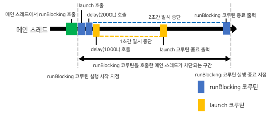  
launch 코루틴은 runBlocking 코루틴의 자식 코루틴이기에 runBlocking 코루틴이 점유한 메인 스레드를 사용할 수 있음

1. runBlocking 코루틴이 launch 함수를 호출하면, launch 코루틴이 생성되고 이어서 runBlocking 코루틴은 delay(2000L) 으로 인해 2초간 메인 스레드가 양보되는데, 이 때 launch 코루틴이 메인 스레드를 점유해 사용
2. launch 코루틴도 1초간 일시 중단 후 메인 스레드를 점유해 launch 코루틴 종료를 출력하고 완료
3. 그 후 2초의 일시 중단을 끝낸 runBlocking 코루틴이 재개돼 종료 출력 후 완료

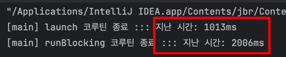

### 섹션 요약
- 구조화된 동시성의 원칙이란 비동기 작업을 구조화함으로써 비동기 프로그래밍을 보다 안정적이고 예측할 수 있게 만드는 원칙이다.

#### 실행 환경 상속
- 부모 코루틴은 자식 코루틴에게 실행 환경을 상속한다.
- 코루틴 빌더 함수의 인자로 CoroutineContext가 전달되면 부모 코루틴의 실행 환경을 덮어 씌울 수 있다.
- 코루틴 빌더 함수 호출시 Job은 상속되지 않고, 새롭게 생성된다. 이때 기존의 Job은 새롭게 생성되는 Job의 부모가 된다.

#### 코루틴의 구조화와 작업 제어
- 코루틴에 취소가 요청되면, 자식 코루틴에 취소가 전파된다.
- 부모 코루틴은 자식 코루틴이 완료될 때까지 완료되지 않는다.
- 부모 코루틴이 실행해야 할 코드가 모두 실행됐는데 자식 코루틴이 실행 중이라면, 부모 코루틴은 '실행 완료 중(Completing)' 상태를 가진다.

#### CoroutineScope 사용해 코루틴 관리하기
- CoroutineScope 인터페이스는 CoroutineContext 를 가진 인터페이스
- launch, async 함수가 호출될 때 CoroutineScope으로부터 실행 환경을 상속 받아 코루틴이 실행된다.
- CoroutineScope 객체를 사용해 특정 범위의 코루틴을 제어할 수 있다.

#### 코루틴의 구조화와 Job
- Job의 구조화가 제어에 핵심 역할을 한다.
- CoroutineScope 생성 함수나, Job 생성 함수를 사용해 코루틴의 구조화를 깰 수 있다.
- Job 생성 함수에 부모 Job을 설정할 수 있고, 이로 생성된 Job은 자동으로 실행 완료가 되지 않기에 complete 함수를 명시적으로 호출해야 한다.

| 코루틴의 구조화를 이해하는 것은, 안정적인 코루틴 코드를 작성하는데 필수적이고, 코드가 예상치 못한 오류가 나지 않게 만들어준다.

<br>

## 예외 처리
> 목표: 코루틴이 예외를 전파하는 것을 이해하고, 예외 전파를 제한하는 방법을 알고, 예외를 처리하는 방법을 안다.
- 코루틴은 비동기 작업을 처리하는 작업 단위이기 때문에 네트워크 요청이나 데이터베이스 입출력 작업 등에 자주 쓰여 예외가 발생할 가능성이 높다.
- 따라서 코루틴에 대한 적절한 예외 처리는 안정적인 애플리케이션을 만들기 위해 매우 중요하다.

### 예외 전파
- 코루틴 실행 도중 예외가 발생하면 예외가 발생한 코루틴이 취소되고, 예외가 부모 코루틴으로 전파된다 -> 다시 자식 코루틴들로 취소가 전파된다.
- 따라서, 모든 코루틴의 작업이 취소될 수 있다.  
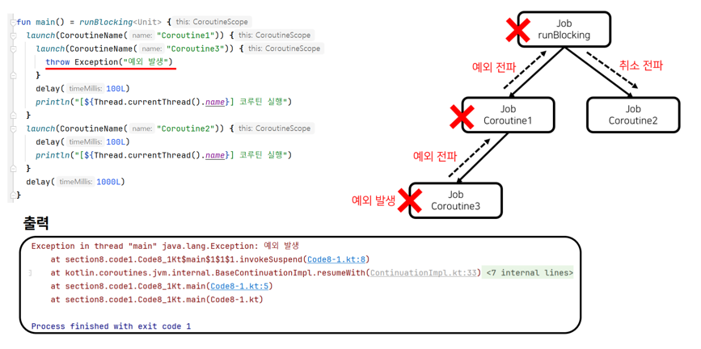

### 예외 전파 제한하기
1. 코루틴의 구조화를 깨서 예외 전파를 제한하기  
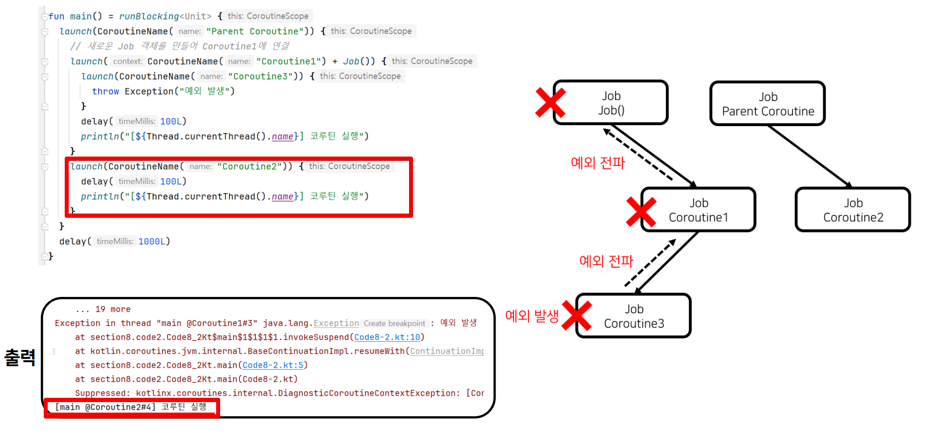
- 단순히 Job 객체를 새로 만들어 구조화를 깨고 싶은 코루틴에 연결화면 구조화가 깨진다.

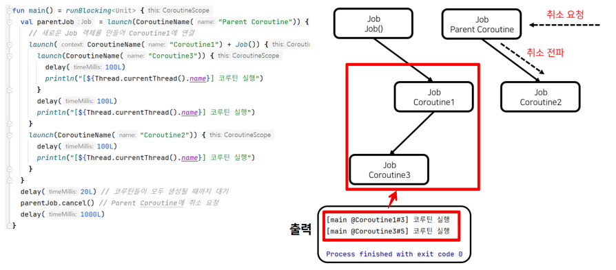
- 하지만 코루틴의 구조화가 깨지면, 예외 전파 뿐만 아니라 취소 전파도 제한된다.
- 위에서 parentJob 코루틴에 취소 요청을 했기에, 구조화가 깨진 Coroutine1, Coroutine3 에는 취소가 안된다.
- Coroutine 구조화를 깨는 것은, 코루틴의 비동기 작업을 불안정하게 만들 수 있다.

2. SupervisorJob 을 사용한 예외 전파 제한
- SupervisorJob 객체는 자식 코루틴으로부터 예외를 전파 받지 않는 특수한 Job 객체이다
  - 예외를 전파 받지 않아 자식 코루틴에서 예외가 발생하더라도 취소되지 않는다
- SupervisorJob 객체는 자식 코루틴에서 발생한 예외가 다른 자식 코루틴에게 영향을 미치지 못하게 만드는데 사용된다

```kotlin
fun main() = runBlocking<Unit> {
    val supervisorJob = SupervisorJob()
    launch(CoroutineName("Coroutine1") + supervisorJob) {
        launch(CoroutineName("Coroutine3")) {
            throw Exception("예외 발생")
        }
        delay(100L)
        println("[${Thread.currentThread().name}] 코루틴 실행1")
    }
    launch(CoroutineName("Coroutine2") + supervisorJob) {
        delay(100L)
        println("[${Thread.currentThread().name}] 코루틴 실행2")
    }
    delay(1000L)
}
```
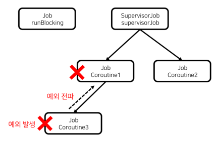
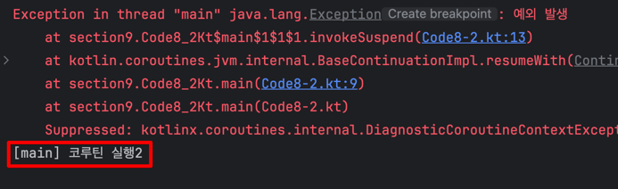
- 하지만 SupervisorJob 은 runBlocking 와의 구조화를 깨는 문제점이 있다.
- 이 문제를 해결하려면, SupervisorJob 인자로 runBlocking 코루틴의 Job 을 넘기면 된다.
  - ```val supervisorJob = SupervisorJob(parent = this.coroutineContext[Job])```
- SupervisorJob 은 자동 완료 처리 되지 않기 때문에, complete() 함수를 호출해 명시적으로 완료시켜줘야 한다.

3. supervisorScope을 사용한 예외 전파 제한  
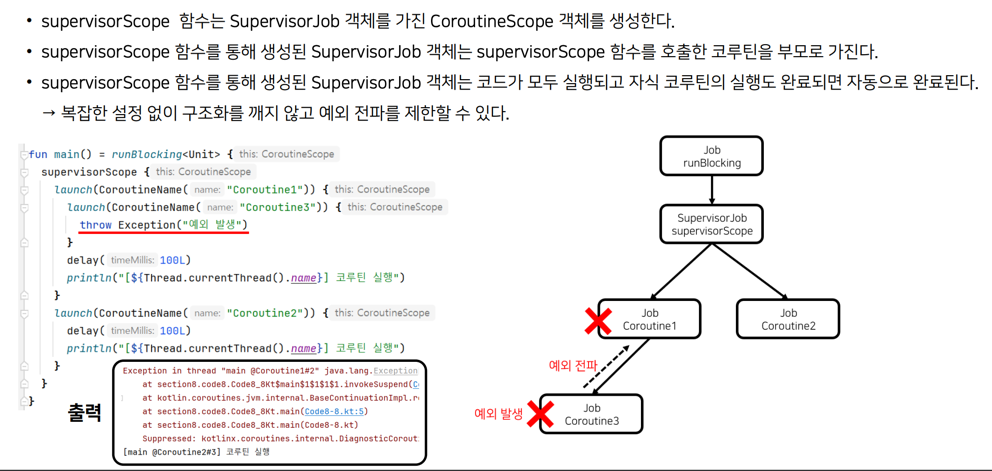

### CoroutineExceptionHandler 사용하여 예외 처리하기
#### CoroutineExceptionHandler 란?
- CoroutineExceptionHandler는 CoroutineContext의 구성 요소 중 하나이다.
- CoroutineExceptionHandler는 처리되지 않은 예외만 처리한다.
- CoroutineExceptionHandler는 launch 코루틴으로 시작되는 코루틴 계층의 공통 예외 처리기로 동작하는 구성요소이다.

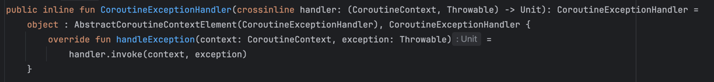
- 예외가 발생했을 때 수행할 동작

```kotlin
fun main() = runBlocking<Unit> {
    val exceptionHandler = CoroutineExceptionHandler { coroutineContext, throwable ->
        println("[예외 발생] ::: $throwable")
    }
    CoroutineScope(context = exceptionHandler)
        .launch(CoroutineName("Coroutine1")) {
            launch(CoroutineName("Coroutine2")) {
                throw Exception("Coroutine2에 예외가 발생했습니다")
            }
        }
    delay(1000L)
}

// [예외 발생] ::: java.lang.Exception: Coroutine2에 예외가 발생했습니다
```
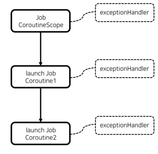

#### 처리되지 않은 예외 처리만 하는 CoroutineExceptionHandler
- CoroutineExceptionHandler는 처리되지 않은 예외만 처리한다.
- 만약 launch 코루틴이 다른 launch 코루틴으로 예외를 전파하면, 예외가 처리된 것으로 보기 때문에 자식 코루틴에 설정된 CoroutineExceptionHandler는 동작하지 않는다.

```kotlin
fun main() = runBlocking<Unit> {
    val exceptionHandler = CoroutineExceptionHandler { coroutineContext, throwable ->
        println("[예외 발생] ::: $throwable")
    }
    CoroutineScope(Dispatchers.IO)
        .launch(CoroutineName("Coroutine1")) {
            launch(CoroutineName("Coroutine2") + exceptionHandler) {
                throw Exception("Coroutine2에 예외가 발생했습니다")
            }
        }
    delay(1000L)
}
```
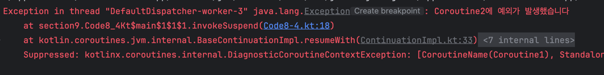
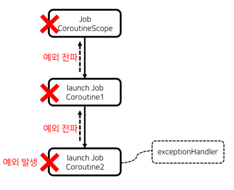

- CoroutineExceptionHandler는 launch 코루틴으로 시작되는 코루틴 계층의 공통 예외 처리기로 동작하는 구성요소이다.
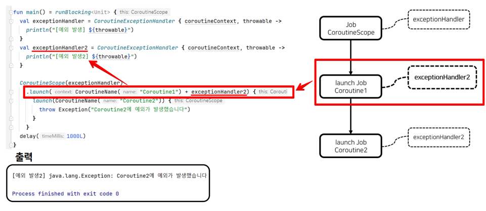


CoroutineExceptionHandler는 예외를 로깅하거나, 오류 메시지를 표시하기 위해 구조화된 코루틴들에 공통으로 동작하는 예외 처리기를 설정해야 하는 경우 사용
```kotlin
fun main() = runBlocking<Unit> {
    val exceptionHandler = CoroutineExceptionHandler { coroutineContext, throwable ->
        println("[예외 로깅] ::: $throwable")
    }

    CoroutineScope(Dispatchers.IO)
        .launch(CoroutineName("Coroutine1") + exceptionHandler) {
            launch(CoroutineName("Coroutine2")) {
                throw Exception("Coroutine2에 예외가 발생했습니다")
            }
            launch(CoroutineName("Coroutine3")) {
                // 다른 작업
            }
        }

    delay(1000L)
}
// [예외 로깅] ::: java.lang.Exception: Coroutine2에 예외가 발생했습니다
```

### try catch 문을 사용해 코루틴에서 발생한 예외 처리
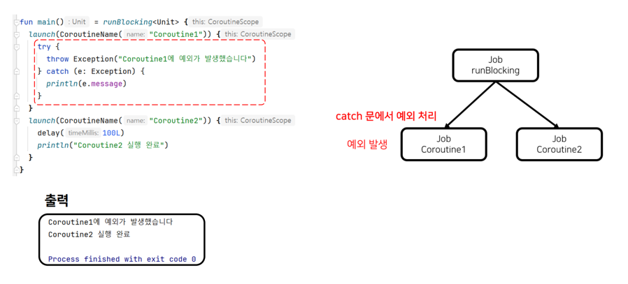

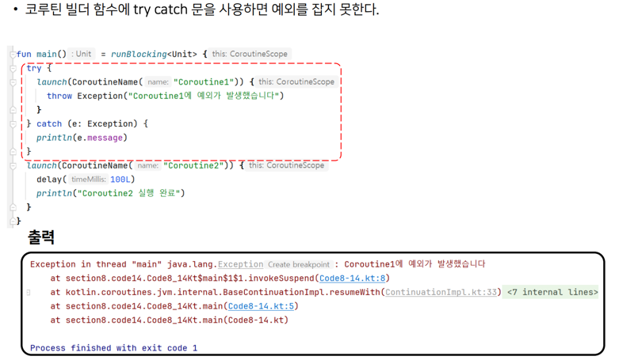

### async 예외 처리
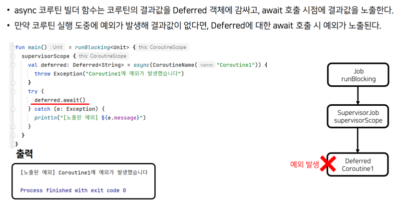

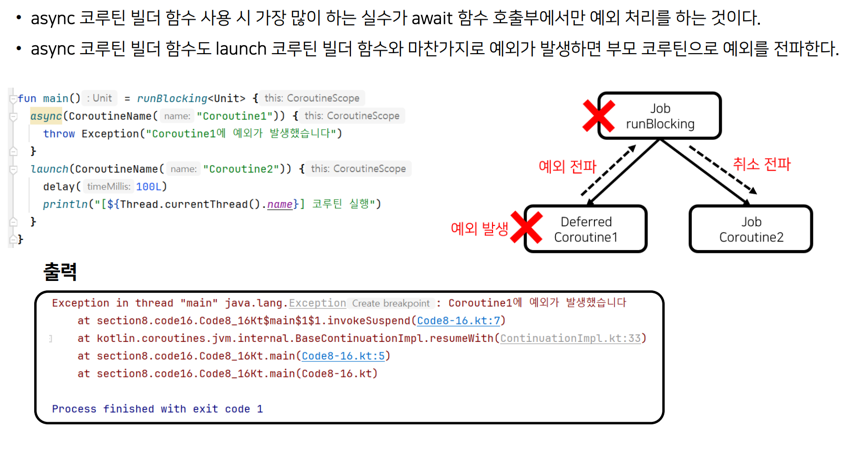

- 위의 경우, supervisorScope 를 사용하여 예외 전파를 막을 수 있다.

### 전파되지 않은 예외 - CancellationException
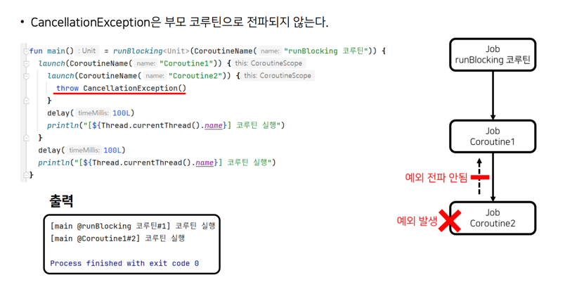
- CancellationException은 코루틴의 취소에 사용되는 특별한 예외이기 때문에 전파되지 않는다.

### 섹션 요약
- 코루틴에 대한 적절한 예외 처리는 안정적인 애플리케이션을 만들기 위해 매우 중요하다.

#### 예외 전파
- 코루틴에서 발생한 예외는 부모 코루틴으로 전파된다.
- 예외를 전파받은 코루틴이 취소되면 해당 코루틴의 모든 자식 코루틴에 취소가 전파된다.

#### 예외 전파 제한하기
- 새로운 루트 Job 객체를 통해 코루틴의 구조화를 깨서 코루틴의 예외 전파를 제한할 수 있다.
- SupervisorJob 객체를 사용해 예외 전파를 제한할 수 있다.
- supervisorScope 함수를 사용해 구조화를 깨지 않고 예외 전파를 제한할 수 있다.

#### CoroutineExceptionHandler 사용해 예외 처리하기
- CoroutineExceptionHandler 객체는 공통 예외 처리기로 동작하고, 이미 처리된 예외에 대해서는 동작하지 않는다.
- CoroutineExceptionHandler 는 예외 전파를 제한하지 않는다.

#### try catch문을 사용한 예외 처리
- 코루틴 내부에서 try catch 문을 사용해 예외를 처리할 수 있다.
- 코루틴 빌더 함수에 대한 try catch문은 코루틴에서 발생한 예외를 처리하지 못한다. (실행 컨텍스트 다름)

#### async 예외 처리
- async 함수로 생성된 코루틴에서 발생한 예외는 await 호출 시 노출된다.
- async 코루틴에서 발생한 예외 또한 부모 코루틴으로 전파된다.

#### 전파 되지 않는 예외
- CancellationException 은 부모 코루틴으로 전파되지 않는다.
- CancellationException이 전파되지 않는 이유는 CancellationException이 코루틴을 취소하기 위한 특별한 예외이기 때문이다

<br>

## 일시 중단 함수
- 코루틴은 일시 중단 지점이 포함된 작업들을 할 수 있다.
- 이런 일시 중단 지점이 포함된 동작은 일반 함수로 만들 수 없어 일시 중단 함수가 필요하다.
- suspend: 일시 중단 함수로 만드는 키워드

### 1. 일시 중단 함수와 코루틴
- 일시 중단 함수란 suspend fun 키워드로 선언되는 함수로 함수 내에 ‘일시 중단 지점’을 포함할 수 있는 함수이다.
- 일시 중단 함수는 코루틴의 일시 중단 지점이 포함된 코드를 재사용할 수 있는 코드의 집합으로 만드는데 사용된다.
- 일시 중단 지점이 포함될 수 있기 때문에 코루틴에서만 호출 가능하다.
- 일시 중단 함수는 코루틴이 아니다.

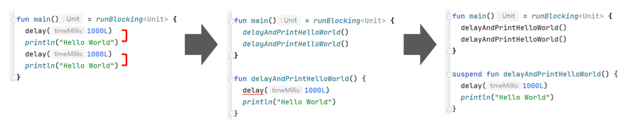

### 2. 일시 중단 함수의 사용
일시 중단을 할 수 있는 곳 -> 1. 코루틴 내부, 2. 일시 중단 함수

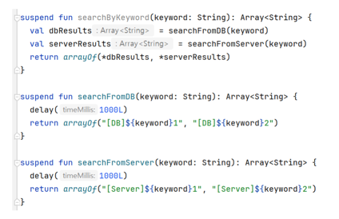
- 위 searchByKeyword 함수가 호출되면 하나의 코루틴에서 DB, Server 가 순차적으로 호출되기 때문에 DB 검색 이후 서버 검색이 된다. (동기적)

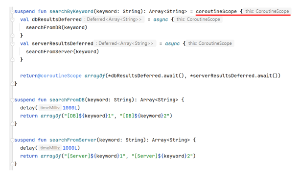
- 위의 문제를 해결하기 위해 coroutineScope 함수를 사용하여 일시 중단 함수 내부에 새로운 CoroutineScope 객체를 생성할 수 있다.

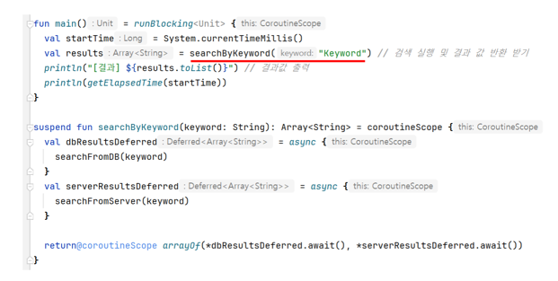
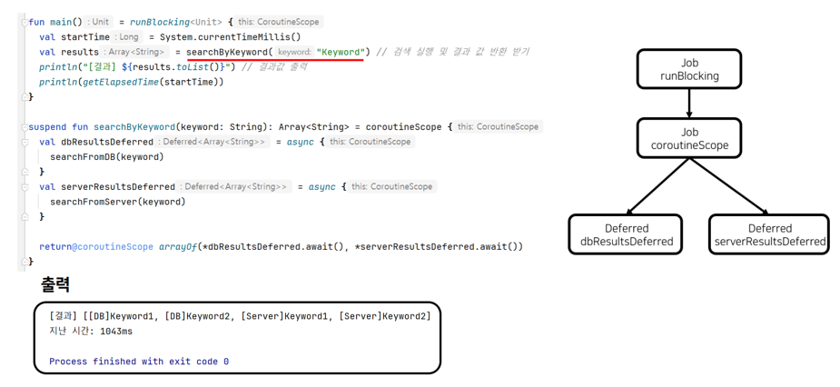
- coroutineScope 내부에서는 DB 결과값을 가져오는 dbResultsDeferred 코루틴과 서버에서 결과값을 가져오는 serverResultsDeferred 코루틴이 생성되어 자식 코루틴이 된다.
- 만약 위에서 DB 조회 코루틴이 예외가 발생한다면? -> 예외가 전파되어 서버에서도 조회가 불가능

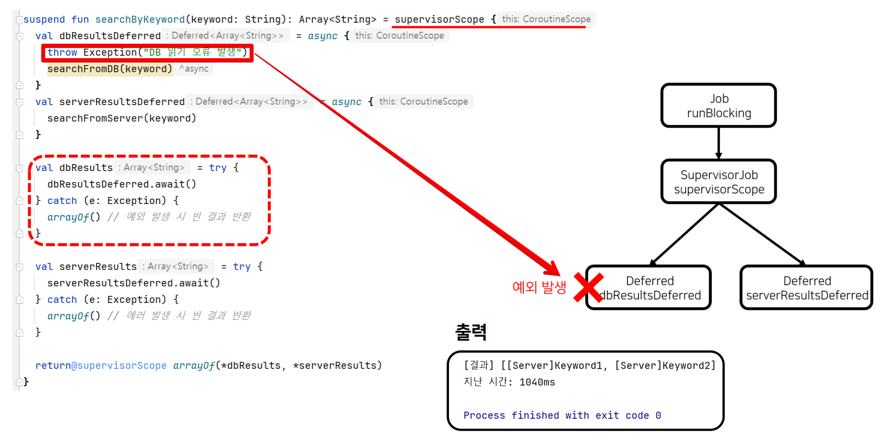
- supervisorScope 활용하여 구조화를 깨지않는 새로운 CoroutineScope 을 만들어 하위의 코루틴과의 예외 전파를 제한할 수 있다.
- Deferred 는 try-catch 로 예외 처리

### 섹션 요약
#### 일시 중단 함수와 코루틴
- 일시 중단 함수란 suspend fun 키워드로 선언되는 함수로 함수 내에 일시 중단 지점을 포함할 수 있는 함수이다.
- 일시 중단 함수는 코드 블록일 뿐 코루틴이 아니다. 호출되더라도 새로운 코루틴을 실행하지 않는다.
- 일시 중단 함수를 새로운 코루틴에서 실행하려면 호출부를 코루틴 빌더로 감싸야 한다

#### 일시 중단 함수의 사용
- 일시 중단 함수는 일시 중단을 할 수 있는 곳에서만 호출할 수 있다. 즉, 코루틴과 일시 중단 함수에서 호출 할 수 있다.
- 일시 중단 함수 내부에서 코루틴 빌더를 호출하기 위해 CoroutineScope이 필요한데, 일시 중단 함수 자체는 CoroutineScope을 제공하지 않는다.
- 일시 중단 함수 내부에서 coroutineScope 함수를 호출해 구조화를 깨지 않는 CoroutineScope을 만들 수 있다.
- supervisorScope은 coroutineScope과 비슷하게 동작하지만, 내부에 Job 대신 SupervisorJob이 설정 되는 것만 다르다

<br>

## 코루틴의 이해
### 1. 루틴, 서브루틴, 코루틴
- 루틴(Routine): 특정한 일을 하기 위한 일련의 처리 과정 -> 함수/메서드
- 서브루틴: 함수(루틴) 내에서 함수가 호출될 경우, 호출된 함수를 의미함
```kotlin
fun routine() {
    routineA() // routineA는 routine의 서브루틴
    routineB() // routineB는 routine의 서브루틴
}
```
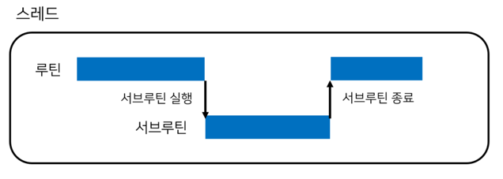

```kotlin
fun main() = runBlocking<Unit> {
    launch {
        while(true) {
            print("A")
            yield() // 스레드 사용 권한 양보
        }
    }

    while(true) {
        print("B")
        yield() // 스레드 사용 권한 양보
    }
}

// ABABABABABAB ...
```
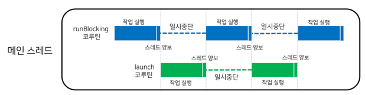
- 루틴에 의해 서브루틴이 호출되면 서브루틴의 실행이 완료될 때까지 다른 작업을 할 수 없는 것과는 다르게,
코루틴은 함께(Co) 실행되는 루틴으로 서로 간에 스레드 사용을 양보하며 함께 실행된다. (협력적으로 동작)

### 2. 코루틴의 스레드 양보
- 코루틴은 작업 중간에 스레드의 사용이 필요 없어지면 스레드를 양보한다. 이때 양보된 스레드는 다른 코루틴이 점유해 사용할 수 있다.
- 스레드를 양보하는 주체는 코루틴이다. 따라서 스레드를 양보하기 위해서는 코루틴이 직접 스레드 양보를 위한 함수를 호출해야 한다.

#### delay 함수를 통해 알아보는 스레드 양보
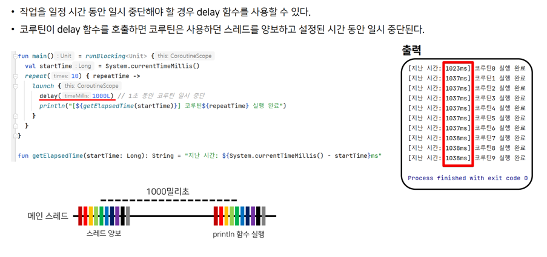
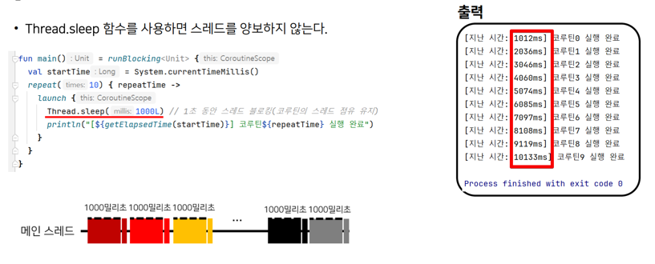
- delay -> 1초 동안 코루틴 일시 중단
- Thread.sleep -> 1초 동안 스레드 블로킹 (코루틴의 스레드 점유)

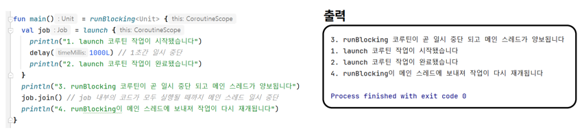

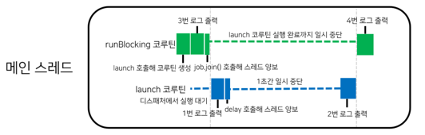
- join, await이 호출되면 대상이 된 코루틴이 완료될 때까지는 스레드를 사용할 필요가 없다기 때문에 스레드 양보가 내부에서 자동으로 실행되고, 다른 코루틴이 스레드 점유가 가능하다.
- join이 있으면 3->1->2->4
- join이 없으면 3->4->1->2

#### yield 함수를 통해 알아보는 스레드 양보
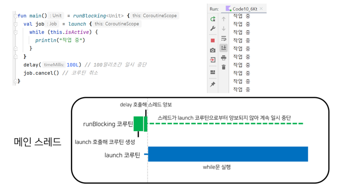
- launch 코루틴이 스레드를 양보하는 부분이 없기에 무한루프가 돈다.

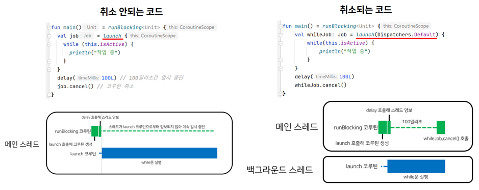

### 3. 코루틴의 실행 스레드
- 코루틴이 일시 중단된 후 재개되면 CoroutineDispatcher 객체는 재개된 코루틴을 다시 스레드에 보낸다.
- 이때 CoroutineDispatcher 객체는 코루틴을 사용할 수 있는 스레드 중 하나에 보내기 때문에, 코루틴이 재개된 후의 실행 스레드는
일시 중단되기 전의 스레드와 다를 수 있다.
- 하지만 스레드를 양보하지 않으면 실행 스레드가 바뀌지 않는다.  
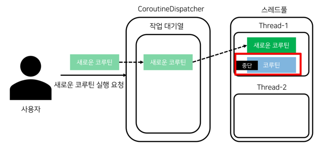
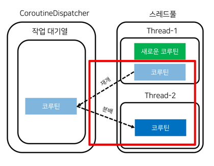

### 섹션 요약
#### 루틴, 서브루틴, 코루틴
- 프로그래밍에서는 루틴을 '특정한 일을 하기 위한 일련의 명령' 이라는 의미로 사용하고, 이를 ‘함수’ 또는 ‘메서드’ 라고도 부른다.
- 함수(루틴) 내에서 함수가 호출될 경우 호출된 함수를 ‘서브루틴’이라고 부른다.
- 루틴에 의해 서브루틴이 호출되면 서브루틴의 실행이 완료될 때까지 다른 작업을 할 수 없는 것과 다르게 코루틴(Coroutine)은 함께(Co) 실행되는 루틴으로 서로 간에 스레드 사용을 양보하며 함께 실행된다.

#### 코루틴의 스레드 양보
- 코루틴이 delay 함수를 호출하면 코루틴은 사용하던 스레드를 양보하고 설정된 시간 동안 일시 중단된다.
- Job의 join 함수나 Deferred의 await 함수가 호출되면 해당 함수를 호출한 코루틴은 스레드를 양보하고, join 또는 await의 대상이 된 코루틴이 완료될 때까지 일시 중단된다.
- yield 함수는 스레드 사용 권한을 명시적으로 양보해야 할 때 사용된다

#### 코루틴의 실행 스레드
- 코루틴이 스레드를 양보하면 코루틴은 일시 중단되고, 이후 재개될 때 실행 스레드가 바뀔 수 있다.
- 코루틴이 스레드를 양보하지 않으면 실행 스레드가 바뀌지 않는다.

<br>

## 코루틴 심화
### 공유 상태를 사용하는 코루틴의 문제와 해결책
#### 가변 변수를 사용할 때의 문제점
- 스레드 간에 데이터를 전달하거나 자원을 공유하는 경우에는 가변 변수를 통해 상태를 공유하고 업데이트 해야 한다
- 이런 경우 여러 스레드에서 가변 변수에 동시에 접근해 값을 변경하면 데이터의 손실이나 불일치로 버그가 발생할 수 있다.
```kotlin
var count = 0

fun main() = runBlocking<Unit> {
    withContext(Dispatchers.Default) {
        repeat(10_000) {
            launch {
                count += 1
            }
        }
    }
    println("count = $count")
}

// count = 9289
// count = 9094
// count = 9686
```

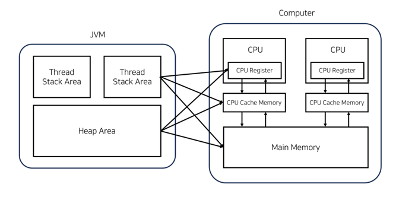
- JVM 스택 영역 -> 원시 타입의 데이터, 지역 변수, 힙 영역에 저장된 객체에 대한 참조가 저장
- 힙 영역 -> JVM 에 올라간 스레드들에서 공통으로 사용되는 메모리 공간으로 객체, 배열 등이 저장
- 각 CPU는 CPU 캐시 메모리를 중간에 두고, 데이터 조회 시 메인 메모리까지 가지 않고 캐시 메모리를 조회하여 접근 속도 향상 (가시성 문제)

#### 공유 상태의 메모리 가시성 문제
- 공유 상태의 메모리 가시성 문제란, 하나의 스레드가 다른 스레드가 변경한 상태를 확인하지 못하는 문제이다.
- 이 문제는 서로 다른 CPU에서 실행되는 스레드들에서 공유 상태를 조회하고 업데이트 할 때 생긴다.

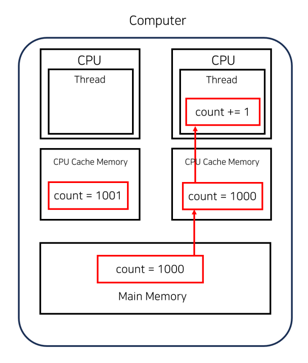
- 업데이트 되지 않은 캐시 메모리로 인해 데이터 불일치 발생
- 이를 위해 volatile(@Volatile) 어노테이션을 통해 가시성 확보 (CPU 캐시 메모리를 사용하지 않고, 메인 메모리 사용)
- 하지만 위의 문제는 여러 스레드가 동시에 메인 메모리에 접근하여 `경쟁 상태 (Race Condition)` 문제가 발생하여 여전히 데이터 불일치가 발생함

#### 경쟁 상태 문제 해결 방법 - 1. Mutex 사용
- 공유 변수의 변경 가능 지점을 `임계 영역(Critical Section)`으로 만들어 동시 접근을 제한할 수 있다.
- 코루틴이 Mutex 객체의 lock 일시 중단 함수를 호출하면 락이 획득되며, 이후 해당 Mutex 객체에 대해 unlock이 호출될 때까지
  다른 코루틴이 해당 임계 영역에 진입할 수 없다.
- ReentrantLock의 lock 함수는 만약 특정 스레드에서 락을 획득했다면, 다른 스레드에서 lock 함수를 호출할 경우
  해당 스레드를 락이 해제될 때까지 블로킹 시킨다. 
- Mutex의 lock 함수는 일시 중단 함수로, 만약 특정 코루틴이 락을 획득했다면, 다른 코루틴에서 lock 함수를 호출할 경우
  해당 코루틴은 락이 해제될 때까지 일시 중단됨(스레드 블로킹X)

```kotlin
// ...

launch {
    mutex.withLock {
        count2 += 1
    }
}
```

#### 경쟁 상태 문제 해결 방법 - 2. 전용 스레드 사용
- 공유 상태 접근 시 하나의 스레드(전용 스레드)만 사용하면 경쟁 상태 문제를 해결할 수 있다
```newSingleThreadContext("전용 스레드")```

#### 경쟁 상태 문제 해결 방법 - 3. 원자성 있는 데이터 구조 사용
- 원자성 있는 객체는 여러 스레드가 동시에 접근하더라도 안전하게 값을 변경하거나 읽을 수 있도록 하는 객체
- Atomic... 변수 (CAS)
- 스레드가 블로킹 될 수 있음

### 코루틴 실행 옵션
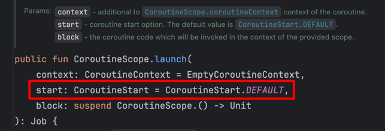

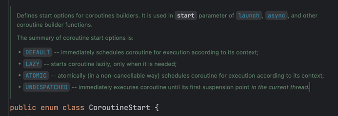

#### DEFAULT vs ATOMIC vs UNDISPATCHED
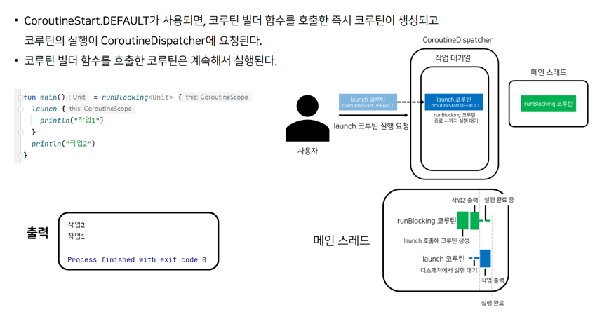

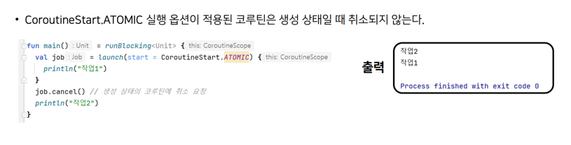

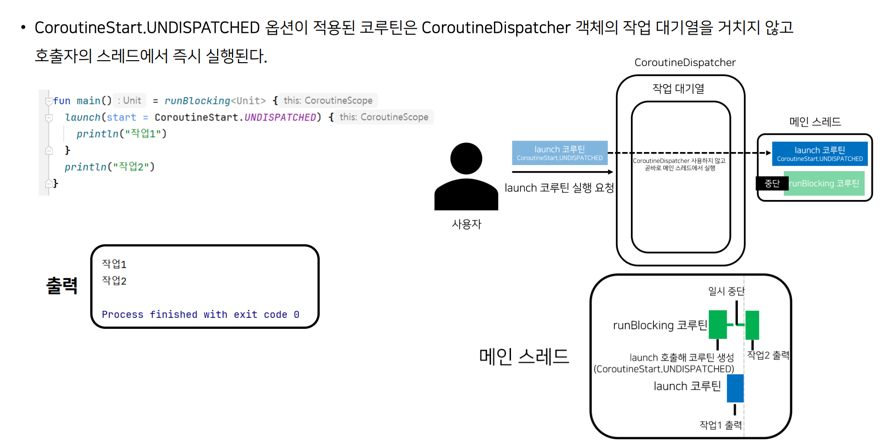

### 무제한 디스패처 (잘 사용하지 않음)
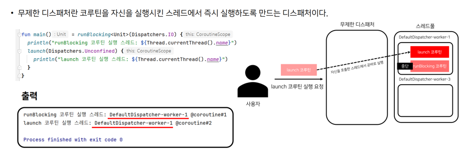

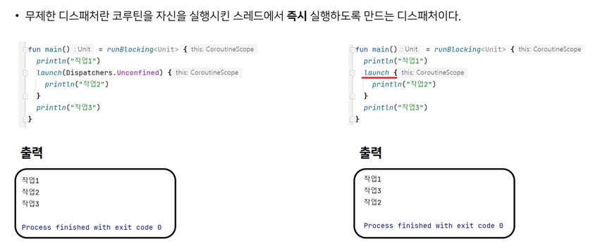

### 코루틴에서 일시 중단과 재개가 일어나는 원리
#### Continuation Passing Style (CPS)
- 코루틴은 Continuation Passing Style 이라 불리는 프로그래밍 방식을 통해 실행 정보를 저장하고 전달한다.
  - 이어서 하는 작업(Continuation)을 전달하는(Passing) 방식(Style)

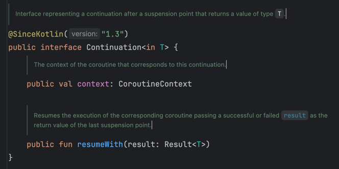
- 코루틴의 일시 중단 시점에 남은 작업 정보가 Continuation 객체에 저장된다
- Continuation의 resumeWith 함수가 호출되면 저장된 작업 정보가 복원돼 남은 작업들이 마저 실행된다.
  즉, resumeWith 함수는 코루틴의 재개를 일으킨다.

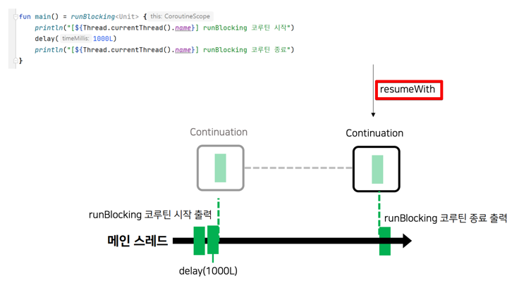

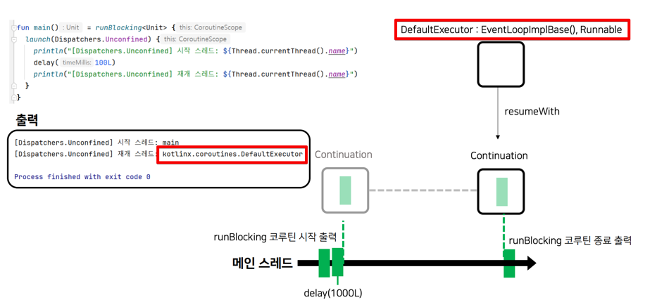

### Continuation Passing Style - Compile
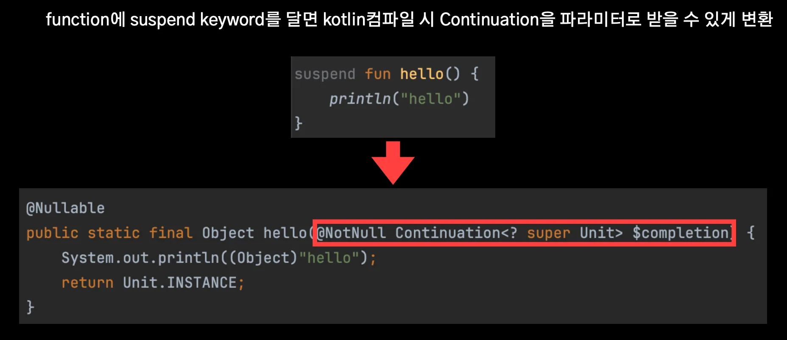
1. suspend keyword를 통해 파라미터에 Continuation을 넣는다.
2. Continuation 초기화
3. switch문으로 suspension point마다 case 추가
4. label을 통해 실행
5. 실행 전 Coroutine의 실패 여부 확인
6. label을 다음 실행할 label로 먼저 올린다.
7. suspend function 실행  
> 참고: https://www.youtube.com/watch?v=Zrq-3ayGddM&list=PLdHtZnJh1KdY3gEi7EPa2AuWn5NKRVmDf&index=8

Continuation 을 직접 다루려면 suspendCancellableCoroutine 을 활용

### 섹션 요약
#### 공유 상태를 사용하는 코루틴의 문제와 해결책
- 멀티스레드 환경에서 실행되는 복수 코루틴이 공유 상태를 사용하면 메모리 가시성 문제나 경쟁 상테 문제가 발생할 수 있다.
- 메모리 가시성 문제는 CPU 캐시와 메인 메모리 간 데이터 불일치로 발생하며, `@Volatile` 을 공유 상태에 설정하여 해결 할 수 있다.
- 경쟁 상태는 복수 스레드가 동시에 데이터 읽고 쓸때 발생한다.
- 코루틴에서는 `Mutex` 객체를 사용해 복수의 코루틴이 특정 코드 블록에 동시 접근하는 것을 막을 수 있다.
- 경쟁 상태 문제를 해결하는 다른 방법은 공유 상태를 읽고 쓰기 위한 전용 쓰레드를 사용하는 것이다.
- AtomicInteger 같은 원자성 있는 자료 구조를 사용해 경쟁 상태 문제를 해결할 수 있다.

#### 코루틴 실행 옵션
- CoroutineStart.ATOMIC: 생성 상태의 코루틴이 취소되지 않게 한다.
- CoroutineStart.UNDISPATCHED: 코루틴이 스레드로 보내지는 과정(Dispatch)을 거치지 않고 코루틴 빌더를 호출한 스레드에서 즉시 실행되게 한다.

#### 무제한 디스패처
- 무제한 디스패처는 코루틴을 자신을 실행시킨 스레드에서 즉시 실행되게 한다.

#### 코루틴에서 일시 중단과 재개가 일어나는 원리
- 코루틴은 `CPS(Continuation Passing Style)` 이라 불리는 프로그래밍 방식을 통해 실행 정보를 저장하고 전달한다.
- 일시 중단될 때 `Continuation` 객체에 실행 정보가 저장되고, Continuation 의 `resumeWith` 함수가 호출되면 재개된다.
- 코루틴 라이브러리의 고수준 API는 Continuation 객체를 외부로 노출하지 않아, 거의 접할 일이 없다. (컴파일 시 내부적으로 생성)
- suspendCancellableCoroutine 일시 중단 함수를 사용하면 Continuation을 직접 다루는 코드를 만들 수 있다.

<br>

## 코루틴 테스트
### 테스트 더블
- 테스트 더블은 객체에 대한 대체물로, 객체들의 행동을 모방하는 객체
- 다른 객체와의 의존성을 가진 객체를 테스트하기 위해 테스트 더블이 필요함
- 테스트 더블의 종류로는 스텁(Stub), 페이크(Fake), 목(Mock) 등이 있다.
#### 스텁(Stub)
- 미리 정의된 데이터를 반환하는 모방 객체
- 반환 값이 없는 함수는 구현하지 않고, 반환 값이 있는 동작만 미리 정의된 데이터를 반환하도록 구현한다.  
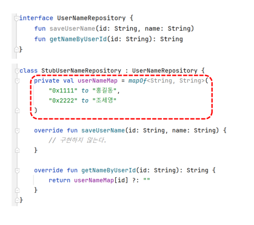
- 스텁을 만들 때 미리 정의된 데이터를 내부 프로퍼티로 고정하면 유연하지 못해진다.
- 미리 정의된 데이터를 주입 받는 형태로 만들어야 한다.  
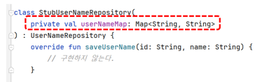

#### 페이크(Fake)
- 실제 객체와 비슷하게 동작하도록 구현된 모방 객체  
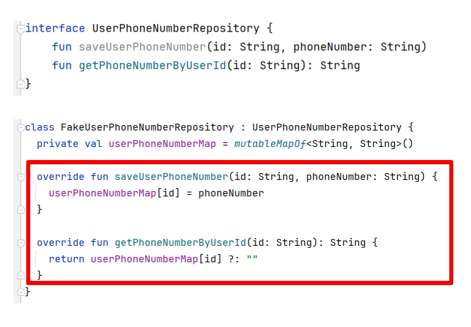

### 코루틴 단위 테스트
- 코루틴에서 runBlocking 함수를 사용해 실행에 오랜 시간이 걸리는 일시 중단 함수(delay)를 테스트하면 문제가 생긴다.
- delay 만큼 시간이 지연된다는 점 -> TestCoroutineScheduler 을 사용해 해결할 수 있다.

### TestCoroutineScheduler + StandardTestDispatcher 를 통해 가상 시간에서 테스트 진행하기
- 코루틴 테스트 라이브러리는 TestCoroutineScheduler 객체를 통해 가상 시간에서 테스트를 진행할 수 있도록 하는 기능을 제공한다.
- TestCoroutineScheduler 객체를 사용하면 시간을 자유 자재로 다룰 수 있다  
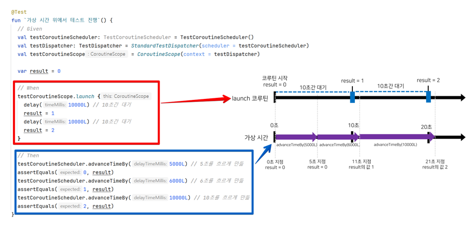

- TestCoroutineScheduler의 advanceUntilIdle 함수가 호출되면 가상 시간 스캐쥴러를 사용하는 모든 코루틴이 완료될 때까지
  시간이 흐른다. (하위 코루틴이 모두 실행되게 만드는 함수)
- TestScope, rutTest 를 활용하면 더 간결한 코드를 작성할 수 있다.  
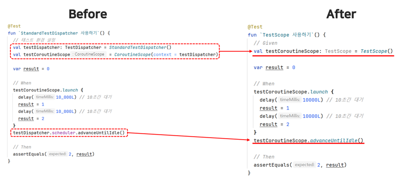

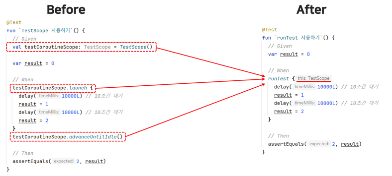

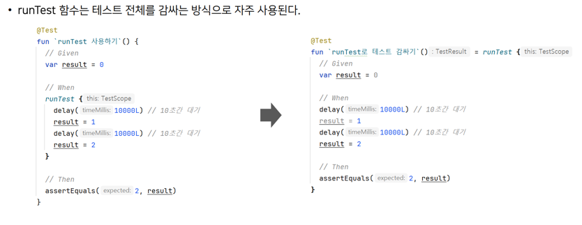
